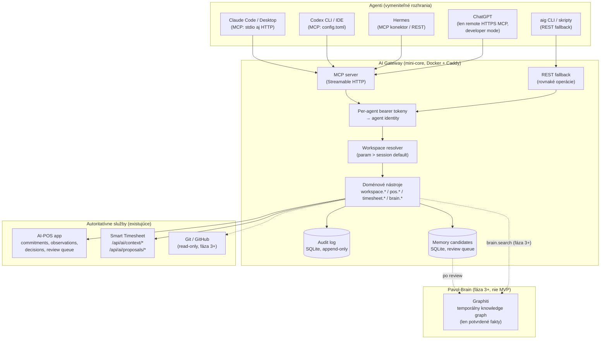
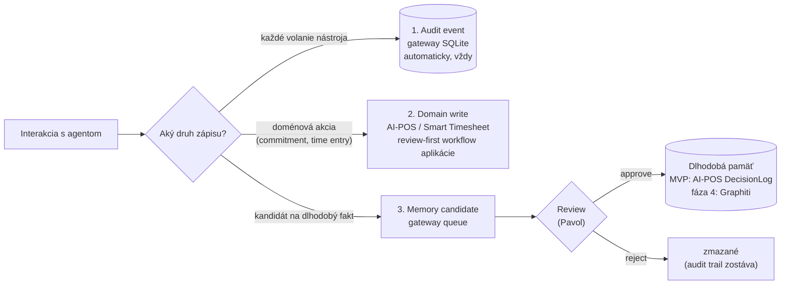
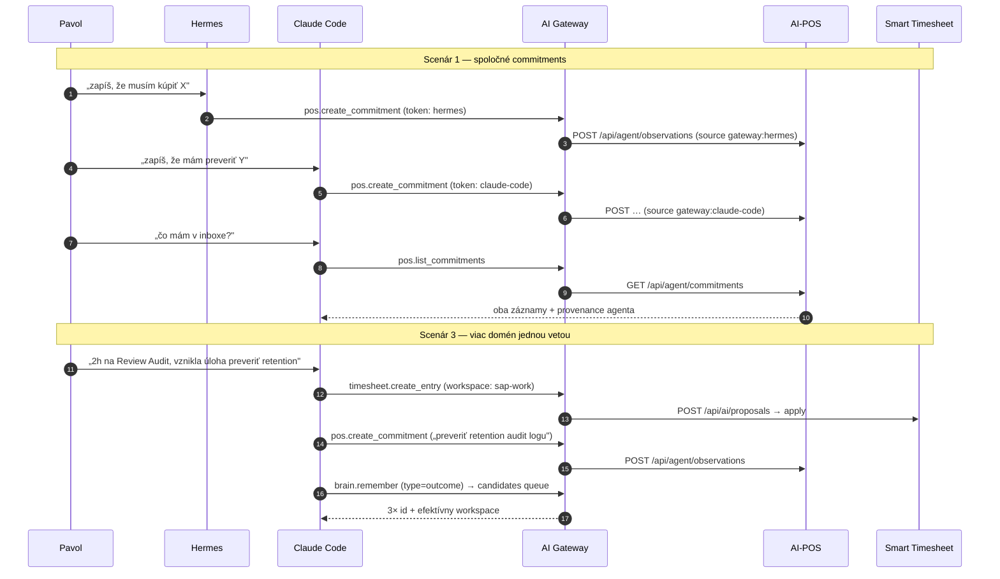

# Proposal 001: Shared AI Gateway and Pavol-Brain

> **Historická poznámka (2026-07-10):** Tento dokument vznikol pod pôvodným názvom projektu `ai-gateway`. Projekt bol následne premenovaný na `pavol-brain`; Proposal 001 zostáva historickým vstupom a jeho pôvodný obsah sa spätne neprepisuje.

- **Status:** Draft na diskusiu (nič z tohto nie je implementované)
- **Dátum:** 2026-07-10
- **Autor:** Claude (Fable 5) na základe zadania Pavla Pavlovského
- **Pracovný názov projektu:** `ai-gateway`
- **Dlhodobý smer (nie prvý scope):** Pavol AI-OS

---

## 1. Executive summary

Navrhujem vybudovať **AI Gateway** — malý, samostatný MCP server bežiaci na mini-core, cez ktorý všetci agenti (Claude, Codex, Hermes, neskôr ChatGPT) volajú tie isté autoritatívne služby: AI-POS pre commitments a observations, Smart Timesheet pre time entries. Gateway pridáva to, čo jednotlivé služby nemajú: identitu agenta (provenance), aktívny workspace scope, audit log a jednotnú množinu doménových nástrojov.

**Pavol-Brain** — spoločná dlhodobá pamäť — sa v prvej fáze **nestavia**. V MVP je „brain" iba kompozičná read vrstva (`brain.get_context` skladá kontext z AI-POS, Smart Timesheet a workspace konfigurácie). Graphiti prichádza do úvahy až vo fáze 3+, po tom, čo gateway preukáže dennú hodnotu.

Kritický záver rešerše: **žiadny existujúci projekt nerieši presne tento problém**, ale nemusíme stavať veľa. Existujúce MCP gateways (IBM ContextForge, MetaMCP, MCPJungle) riešia *agregáciu cudzích MCP serverov*, nie doménové nástroje nad vlastnými autoritatívnymi aplikáciami s provenance. Mem0/OpenMemory rieši *ploché zdieľané memories*, čo by podkopalo review-first autoritu AI-POS. Graphiti je zrelý kandidát na neskoršiu znalostnú vrstvu. „Graphify" je niečo úplne iné (knowledge graph *kódu* pre coding assistantov) a nie je komponentom tejto architektúry. Julian Goldie „Agent OS" je marketingový/kurzový obsah, nie softvér.

Najväčšie reálne riziká nie sú technické: (1) systém, ktorého údržba stojí viac času, než šetrí, (2) ChatGPT vyžaduje verejne dostupný HTTPS endpoint, čo je v konflikte s LAN/VPN-only mini-core, (3) prerekvizita — ai-pos-app dnes **nemá žiadne agentné API**, takže minimálny commitments endpoint treba schváliť ako samostatnú zmenu.

**Odporúčanie:** postaviť MVP v rozsahu ~1–2 týždňov práce (jeden TypeScript MCP server, ~10 nástrojov, SQLite audit, žiadny Graphiti, žiadny event bus), merať reálne použitie 4 týždne a mať vopred definované kill kritériá.

---

## 2. Problem statement

Dnes používam viacero nezávislých agentov a rozhraní: ChatGPT, Codex, Claude (Code/Desktop), Hermes a lokálne nástroje. Každý má:

- **iný kontext** — čo som povedal jednému, druhý nevie,
- **inú pamäť** — Claude má svoje memory súbory, Hermes svoje profily, ChatGPT svoju memory,
- **iné možnosti** — rôzna podpora nástrojov a integrácií,
- **žiadny spoločný prístup k mojim autoritatívnym dátam** — commitments v AI-POS a time entries v Smart Timesheet vidí len ten, kto má náhodou nakonfigurovaný prístup (dnes prakticky nikto).

Konkrétne denné bolesti:

1. **Opakovanie kontextu.** Každému agentovi musím znova vysvetliť, na čom pracujem, čo je AI-POS, aké boli posledné rozhodnutia.
2. **Stratené záväzky.** Úloha, ktorá vznikne v konverzácii s Codexom, sa nedostane do AI-POS, pokiaľ ju ručne neprenesiem. To je priamo v rozpore s north star AI-POS („nechcem strácať záväzky len preto, že som ich nespracoval hneď").
3. **Manuálny handoff.** Výsledok práce jedného agenta musím skopírovať druhému.
4. **Lock-in rozhodnutí do runtime.** ADR 0012 tento problém už pomenoval pre Hermes: znalosť uložená v runtime umiera s runtime. To isté platí pre pamäť ChatGPT alebo Claude memory — sú to silá viazané na poskytovateľa.

Základná hodnota, ktorú chceme:

> **Agent je vymeniteľné rozhranie. Dáta, záväzky, pracovný kontext, rozhodnutia a história sú moje a nie sú uzamknuté v jednom modeli ani u jedného poskytovateľa.**

## 3. Vision

Cieľový stav (nie prvý implementačný rozsah):

1. Poviem **ľubovoľnému** agentovi „zapíš, že musím kúpiť X" → vznikne commitment v AI-POS s provenance „vytvoril Hermes / Claude / ChatGPT".
2. Spýtam sa **iného** agenta „čo mám kúpiť?" → načíta ten istý zoznam z AI-POS cez tú istú gateway.
3. Aktivujem workspace (`/use ai-pos-app`) → agent dostane relevantný kontext: otvorené commitments daného projektu, posledné rozhodnutia, stav repozitára, relevantné dokumenty.
4. Potvrdené rozhodnutia a výsledky práce sa ukladajú do dlhodobej pamäte (najprv AI-POS DecisionLog, neskôr Graphiti) — **cez review, nie automaticky**.
5. Rovnaký princíp sa postupne rozšíri na Smart Timesheet, Git/GitHub, homelab, SAP prácu, Outlook/kalendár.

Dlhodobo môže systém vyrásť na **Pavol AI-OS**. Ale prvá verzia je zámerne len úzka rúra: *spoločné doménové nástroje + identita + workspace + audit*.

## 4. Non-goals

Explicitne **nebudujeme** (v tomto návrhu ani v MVP):

- ❌ Kompletný autonómny „AI operačný systém" — žiadne plánovanie agentov, orchestrácia, model routing.
- ❌ Event bus, message queue, pub/sub.
- ❌ Dashboard alebo UI (AI-POS a Smart Timesheet už svoje UI majú).
- ❌ Komplikovaný permission systém (role, politiky, ACL engine). Stačí: per-agent token + klasifikácia nástrojov + confirm gating.
- ❌ Kubernetes alebo nová infraštruktúra — použije sa existujúci vzor: Docker Compose + Caddy na mini-core.
- ❌ Náhrada AI-POS, Smart Timesheet alebo ich dátových modelov. Gateway je klient, nie nový master.
- ❌ Graphiti v MVP. Ani Mem0/OpenMemory ako primárna pamäť.
- ❌ Automatické ukladanie konverzácií do dlhodobej pamäte.
- ❌ Multi-user. Systém je single-user (Pavol) so single-tenant bezpečnostným modelom.
- ❌ Write-back do zdrojových systémov, ktoré gateway nevlastní (Outlook, SAP) — read-only, ak vôbec, a až neskôr.

## 5. Terminology

| Pojem | Význam |
|---|---|
| **AI Gateway** | Tento projekt. MCP/REST server, ktorý vystavuje doménové nástroje nad autoritatívnymi službami a pridáva identitu, workspace, audit. |
| **Agent** | Konkrétne AI rozhranie/runtime: Claude Code, Claude Desktop, Codex, ChatGPT, Hermes. Vymeniteľný klient gateway. |
| **Agent identity** | Stabilný identifikátor agenta (`hermes`, `claude-code`, `chatgpt`, …) odvodený z per-agent tokenu, nie z tvrdenia klienta. |
| **Autoritatívna služba** | Aplikácia, ktorá vlastní doménu: AI-POS (commitments, observations, decisions), Smart Timesheet (time entries, clients, work areas). |
| **Workspace / scope** | Pomenovaný pracovný kontext (`personal`, `ai-pos-app`, `sap-work`, …), ktorý určuje relevantné služby, dokumenty, repo a audit metadata. |
| **Pavol-Brain** | Dlhodobá kompozičná kontextová vrstva. V MVP len read-kompozícia autoritatívnych zdrojov; neskôr aj Graphiti. Nie je to jedna databáza. |
| **Domain write** | Zápis do autoritatívnej služby (napr. vytvorenie commitmentu). |
| **Memory candidate** | Potenciálny dlhodobý fakt/rozhodnutie čakajúci na review pred zápisom do dlhodobej pamäte. |
| **Audit event** | Technický záznam vykonanej operácie (kto, čím, kedy, čo, v akom scope). |
| **Provenance** | Pôvod dát: ktorý agent, z akého zdroja, v akom workspace operáciu vykonal. AI-POS už provenance koncept má (Observation → Commitment); gateway ho rozširuje o agent identitu. |
| **mini-core** | Mac mini home server (OrbStack, Docker Compose, Caddy, LAN/VPN only), kde bežia existujúce aplikácie. |

## 6. Proposed architecture



Kľúčové architektonické rozhodnutia:

1. **Gateway je tenká.** Žiadna doménová logika, žiadna interpretácia obsahu (v súlade s guardrailom G-11 z behavior packu: „konektory sú hlúpe"). Validuje vstup, doplní identitu + workspace + audit, zavolá autoritatívnu službu, vráti výsledok.
2. **Jedna služba, dva transporty.** MCP (Streamable HTTP) ako primárne rozhranie; tenký REST nad tou istou vrstvou nástrojov pre CLI a agentov bez MCP. Nie sú to dve implementácie — REST endpointy sú generované z tej istej definície nástrojov.
3. **Autorita zostáva v aplikáciách.** Gateway nikdy nedrží master kópiu doménových dát. Jediné vlastné dáta gateway: audit log, memory candidates queue, workspace registry, agent tokeny.
4. **Žiadna synchronizácia.** Gateway číta a zapisuje synchrónne do služieb. Ak služba nebeží, operácia zlyhá čitateľnou chybou — žiadne fronty a retry sagy v MVP.
5. **Konzistentný deploy vzor.** Docker Compose + Caddy na mini-core, ako smart-timesheet a ai-pos-app. Žiadna nová infraštruktúra.

## 7. Rozdelenie: AI Gateway, Pavol-Brain, AI-POS a ostatné služby

Hranice vlastníctva — rozšírenie ownership mapy z ADR 0012 a behavior packu:

| Vrstva | Vlastní | Nesmie obsahovať |
|---|---|---|
| **AI Gateway** | prístup: tool definitions, agent identity, workspace registry, audit log, memory candidates *queue* (len fronta, nie schválený obsah) | doménové dáta, doménovú logiku, schválené dlhodobé fakty, interpretáciu obsahu |
| **AI-POS** | commitments, observations, workflow stavy, review queue, provenance observation→commitment, DecisionLog, Entity/Link graf | time entries, kód, runtime konfigurácie agentov |
| **Smart Timesheet** | time entries, clients, work areas, daily/reporting dáta, Redmine export | commitments, dlhodobé fakty |
| **Pavol-Brain** | *kompozíciu* kontextu z autoritatívnych zdrojov; neskôr Graphiti graf potvrdených faktov s temporálnou platnosťou | živé tasks/commitments/time entries (tie má vždy doménová aplikácia), neschválené kandidáty |
| **Git/GitHub** | stav kódu, história, PR | — (gateway číta, nezapisuje) |
| **Agent runtime** (Hermes profil, Claude memory, …) | execution mechanics, cache, kompilované renderingy | kanonickú znalosť (ADR 0012 litmus test) |

Dôležité dôsledky:

- **AI-POS sa nenahrádza Graphiti.** Graphiti (ak príde) drží *potvrdené, stabilné fakty a vzťahy s temporálnou platnosťou* — nie živý workflow. Otázka „čo mám dnes urobiť" ide vždy do AI-POS; otázka „prečo sme sa v marci rozhodli pre SQLite" môže ísť do Brain.
- **DecisionLog v AI-POS je prirodzený domov pre potvrdené rozhodnutia** už dnes (ADR 0012 ho explicitne menuje). `brain.remember(type=decision)` preto v MVP smeruje do AI-POS, nie do novej databázy. To odkladá potrebu Graphiti bez straty dát — Graphiti sa neskôr môže plniť *z* AI-POS.
- **Gateway memory-candidates queue je dočasný buffer, nie pamäť.** Kandidát bez review nemá autoritu a po zamietnutí sa maže.

## 8. Identity and agent provenance

**Identita používateľa:** systém je single-user. Používateľ = Pavol, implicitne. Netreba OAuth user model v MVP; per-agent token zároveň autentifikuje „Pavla cez agenta X". (Výnimka: ChatGPT connector vyžaduje OAuth flow — pozri §10 a §14.)

**Identita agenta:** každý agent dostane vlastný bearer token pri registrácii (ručne, config súbor — žiadny signup flow). Token mapuje na záznam:

```yaml
# agents.yaml (v repo gateway, tokeny v .env / keychain, nie v gite)
agents:
  - id: claude-code
    label: "Claude Code (MacBook)"
    default_workspace: null      # žiadny implicitný scope
  - id: hermes
    label: "Hermes (mini-core)"
  - id: codex
    label: "Codex CLI"
  - id: chatgpt
    label: "ChatGPT (remote)"    # fáza 2, OAuth
```

**Zásada: identita sa odvodzuje z tokenu, nie z tvrdenia klienta.** Agent nemôže poslať `agent_id: hermes` v parametri — to by bola len konvencia, ktorú halucinujúci model poruší.

**Provenance pri domain writes:** každý zápis do AI-POS/Smart Timesheet nesie:

```json
{
  "origin": {
    "channel": "gateway",
    "agent": "hermes",
    "workspace": "personal",
    "gateway_event_id": "evt_01J...",
    "occurred_at": "2026-07-10T09:15:00+02:00"
  }
}
```

AI-POS už má provenance model (Observation → Commitment, model provenance v DecisionLog). Návrh: commitment vytvorený cez gateway vznikne štandardnou AI-POS cestou — ako Observation so source `gateway:hermes` + inbox Commitment — takže review cockpit a provenance reťaz AI-POS fungujú bez zmeny konceptu. **Gateway sa nesnaží obísť review-first DNA AI-POS.**

Kriticky: nerozlišujeme v MVP „ktorý model" (Fable vs. Opus vs. GPT-5) — len ktorý *agent kanál*. Model provenance rieši AI-POS pri analýzach; pre gateway by to bola predčasná granularita. Ak sa ukáže potreba, pridá sa pole `model_hint` (self-reported, explicitne nedôveryhodné).

## 9. Workspace and scope model

### Čo workspace ovplyvňuje

Workspace je pomenovaný záznam v `workspaces.yaml`:

```yaml
workspaces:
  - id: ai-pos-app
    label: "AI-POS aplikácia"
    services: [ai-pos]            # ktoré doménové služby sú relevantné
    repo: ~/Documents/Personal/Projects/ai-pos-app
    docs:
      - ~/Documents/Personal/Projects/ai-pos/docs/00-north-star.md
      - ~/Documents/Personal/Projects/ai-pos/docs/adr/
    pos_filter: { project: "ai-pos-app" }   # ako filtrovať commitments
    tools_deny: [timesheet.*]     # v tomto scope netreba timesheet
  - id: sap-work
    label: "SAP projekty"
    services: [smart-timesheet, ai-pos]
    sensitivity: work             # audit flag, budúce filtrovanie pamäte
  - id: personal
    label: "Osobné"
    services: [ai-pos]
```

Aktívny workspace ovplyvňuje: (a) dostupné nástroje (deny-list), (b) filter pri `pos.list_commitments` a `brain.get_context`, (c) ktoré dokumenty vráti `workspace.get_context`, (d) audit metadata, (e) neskôr scope vyhľadávania v Graphiti.

### Kritické posúdenie: globálny vs. session vs. explicitný

| Model | Výhoda | Fatálna slabina |
|---|---|---|
| **Globálny mutable stav** („teraz je aktívny ai-pos-app pre všetkých") | jednoduchý mentálny model | race condition: Hermes beží automatizáciu v `personal`, ja medzitým v Claude aktivujem `sap-work` → Hermesov zápis dostane zlý scope. Neakceptovateľné. |
| **Len session default** | prirodzené pre interaktívnu prácu | MCP „session" je krehký pojem: ChatGPT konverzácie žijú dni, stdio session zanikne reštartom; stale scope = tichý zlý zápis |
| **Len explicitný parameter** | vždy správne, auditovateľné | otravné — presne to „opakovanie kontextu", ktoré chceme odstrániť; agenti budú parameter halucinovať |

**Rozhodnutie: hybrid s explicitným zvyškovým pravidlom.**

1. Každý doménový nástroj má **voliteľný parameter `workspace`**. Ak je uvedený, platí (a validuje sa proti registry).
2. `workspace.activate` nastaví default **per session daného agenta** (kľúč: agent token + MCP session id). Nikdy nie globálne naprieč agentmi.
3. Ak nie je ani parameter, ani session default → **read operácie** bežia bez scope filtra (vrátia všetko, označené workspace-om), **write operácie** vyžadujú explicitný workspace alebo padnú s chybou `workspace_required`. Zlý zápis je horší než otravná chyba.
4. Session default **expiruje** (návrh: 8 hodín) a odpoveď každého write nástroja obsahuje efektívny workspace, aby model aj používateľ videli, kam sa zapisuje.
5. Audit event vždy zaznamená efektívny workspace **a spôsob rezolúcie** (`explicit` / `session-default` / `none`).

`/use ai-pos-app` v ľubovoľnom agentovi je potom len prompt-konvencia, ktorá zavolá `workspace.activate`.

## 10. MCP / API / CLI integration model

Reálny stav podpory (overené júl 2026):

| Agent | Mechanizmus | Obmedzenia | MVP? |
|---|---|---|---|
| **Claude Code / Desktop** | plný MCP klient: stdio aj remote (Streamable HTTP), OAuth aj bearer | žiadne podstatné | ✅ fáza 1 |
| **Codex CLI / IDE** | MCP v `~/.codex/config.toml` (`[mcp_servers.*]`), stdio aj `transport`+`url` HTTP; CLI a IDE zdieľajú config | historicky muchy s HTTP servermi; stdio bridge ako záloha | ✅ fáza 1 |
| **Hermes** | má koncept MCP konektorov (behavior pack G-11, mechanické gating write akcií) | **treba overiť** reálnu podporu remote MCP; fallback REST je triviálny | ✅ fáza 1 (cez MCP alebo REST) |
| **ChatGPT** | developer mode (beta): plný MCP vrátane write tools, s user confirmations | **len remote HTTPS** (SSE/Streamable HTTP), žiadne stdio; vyžaduje verejne dosiahnuteľný endpoint + OAuth alebo no-auth; dostupné na Plus/Pro | ⚠️ fáza 2 — vyžaduje expozičné rozhodnutie (§14) |
| **CLI / skripty / cron** | `aig` CLI → REST | — | ✅ fáza 1 (minimálne `aig pos add`, `aig pos list`) |

Návrh integrácie:

1. **Primárne: jeden remote MCP endpoint** `https://gateway.<lan-doména>/mcp` (Streamable HTTP, bearer token per agent). Jeden server, všetky nástroje; workspace deny-listy filtrujú `tools/list` odpoveď podľa session.
2. **REST fallback** na `/v1/tools/<tool-name>` (POST, JSON body = tool args). Generovaný z tej istej tool registry — žiadna druhá implementácia.
3. **stdio bridge pre okrajové prípady:** existujúci `sparfenyuk/mcp-proxy` (MIT) prekladá Streamable HTTP ↔ stdio, netreba písať vlastný.
4. **ChatGPT (fáza 2):** vyžaduje verejný HTTPS + OAuth. Možnosti: Cloudflare Tunnel alebo Tailscale Funnel pred Caddy, OAuth vrstva (napr. built-in v FastMCP/TS SDK auth middleware). Toto je jediné miesto, kde sa gateway dotýka verejného internetu — preto je to samostatné rozhodnutie s vlastným bezpečnostným posúdením, nie súčasť MVP.
5. **Spoločná konfigurácia agentov:** repo gateway obsahuje `clients/` s hotovými config snippetmi (`claude.mcp.json`, `codex.config.toml`, Hermes konektor profil, ChatGPT connector návod) generovanými z jednej šablóny — aby pridanie nástroja neznamenalo štyri ručné úpravy.

## 11. Domain tool design

Zásada: **explicitné, úzke, doménové nástroje** — žiadne `gateway.execute("urob niečo")`. Dôvody: (a) permission gating sa dá robiť per nástroj, (b) modely volajú presné nástroje spoľahlivejšie než open-ended príkazy, (c) audit je zmysluplný, (d) ChatGPT/Claude confirmations fungujú per tool.

### Klasifikácia operácií

| Trieda | Správanie | Príklady |
|---|---|---|
| **read-only** | bez potvrdenia, bez side-effects, `readOnlyHint: true` v MCP anotácii | `workspace.list`, `pos.list_commitments`, `timesheet.get_today`, `brain.search` |
| **write** | vytvára nové dáta, reverzibilné doménovým workflow (inbox → dropped), bez interaktívneho potvrdenia | `pos.create_commitment`, `pos.capture_observation`, `timesheet.start` |
| **write-confirm** | mení existujúce dáta; gateway vyžaduje `confirm: true` + echo zhrnutia zmeny | `pos.update_commitment`, `pos.complete_commitment`, `timesheet.create_entry` pre minulé dni, `brain.correct` |
| **destructive** | nenávratná strata; dvojkrokový protokol (nástroj vráti `confirmation_token`, druhé volanie ho musí predložiť) | `brain.forget`, `timesheet.delete_entry` |

Poznámka k AI-POS: „delete commitment" **neexistuje** — AI-POS má stav `dropped`, čo je write-confirm, nie destructive. To je správne a gateway to rešpektuje.

Poznámka k `timesheet.create_entry`: Smart Timesheet už má **proposal API** (`/api/ai/proposals` + apply/reject). Gateway ho využije: write od agenta = proposal, apply = po potvrdení. Confirmation mechanizmus teda netreba vymýšľať — existuje.

### Katalóg nástrojov (MVP množina označená ●)

**Workspace**

| Nástroj | Trieda | Popis |
|---|---|---|
| ● `workspace.list` | read | zoznam workspace-ov s labelmi |
| ● `workspace.current` | read | efektívny workspace session + spôsob rezolúcie |
| ● `workspace.activate` | write (session-only) | nastaví session default; vráti expiráciu |
| ● `workspace.get_context` | read | kompaktný kontext balík: popis, otvorené commitments (top N), posledné rozhodnutia, odkazy na docs, repo stav (fáza 3) |

**AI-POS**

| Nástroj | Trieda | Popis |
|---|---|---|
| ● `pos.create_commitment` | write | vytvorí Observation (source `gateway:<agent>`) + inbox Commitment; vráti id + efektívny workspace |
| ● `pos.list_commitments` | read | filter: stav, workspace/projekt, direction |
| ● `pos.capture_observation` | write | quick-capture poznámka bez commitmentu |
| ● `pos.record_decision` | write-confirm | zapíše potvrdené rozhodnutie do DecisionLog (scenár 2) |
| ○ `pos.update_commitment` | write-confirm | zmena titulku/poznámky/stavu (fáza 2) |
| ○ `pos.complete_commitment` | write-confirm | prechod na `done` (fáza 2 — completion cez agenta chce rozmysel, či nemá ísť cez review) |

**Smart Timesheet**

| Nástroj | Trieda | Popis |
|---|---|---|
| ● `timesheet.get_today` | read | wrapper nad existujúcim `/api/ai/context/today` |
| ● `timesheet.create_entry` | write / write-confirm | cez existujúce proposal API; dnešný deň = write, minulé dni = confirm |
| ○ `timesheet.start` / `timesheet.stop` | write | timer (fáza 2; závisí od podpory v Smart Timesheet) |
| ○ `timesheet.get_week` | read | fáza 2 |

**Brain**

| Nástroj | Trieda | Popis |
|---|---|---|
| ● `brain.get_context` | read | v MVP: kompozícia workspace.get_context + pos + timesheet; žiadna vlastná databáza |
| ● `brain.remember` | write | `type=decision` → AI-POS DecisionLog; ostatné typy → **memory candidate queue** (nie priamy zápis do pamäte) |
| ○ `brain.search` | read | fáza 3+ (Graphiti); v MVP alias na pos.list + candidates search |
| ○ `brain.correct` | write-confirm | fáza 3+: supersede faktu (Graphiti invalid_at + nový fakt) |
| ○ `brain.forget` | destructive | fáza 3+: dvojkrokové potvrdenie; zachová tombstone v audite |

Návrhové detaily:

- Každá write odpoveď obsahuje `{ id, workspace, agent, summary }` — model má čo zopakovať používateľovi a halucinácia „zapísal som to" je overiteľná.
- Tool descriptions obsahujú explicitné inštrukcie kedy nástroj **nepoužiť** (napr. `brain.remember`: „nepoužívaj na priebežné poznámky z konverzácie; len na potvrdené rozhodnutia a stabilné fakty").
- Idempotencia: `pos.create_commitment` prijíma voliteľný `dedupe_key`; gateway pri rovnakom kľúči v okne 24 h vráti existujúci záznam namiesto duplikátu (ochrana pred retry slučkami agentov).

## 12. Memory and Graphiti strategy

### Tri druhy zápisu (nikdy sa nemiešajú)



1. **Audit event** — technická stopa. Vzniká automaticky pri každom volaní. Nie je to pamäť; nikto ju „nespomína", slúži na debugging, provenance a nedôveru.
2. **Domain write** — autoritatívny zápis. Review rieši doménová aplikácia (AI-POS inbox, Smart Timesheet proposals).
3. **Memory candidate** — jediná cesta do dlhodobej pamäte. **Nikdy nie priamy zápis.** Konzistentné s review-first DNA AI-POS a s A-06 gate z behavior packu.

### Čo smie byť memory candidate (typovaný whitelist)

| Typ | Príklad | Cieľ po approve |
|---|---|---|
| `decision` | „AI-POS zostáva na SQLite, revisit pri >100k observations" | AI-POS DecisionLog (už v MVP, bez čakania na Graphiti) |
| `stable_fact` | „mini-core beží OrbStack, LAN/VPN only" | Graphiti (fáza 4) |
| `preference` | „Pavol chce návrhy najprv ako proposal, nie hotový kód" | Graphiti / behavior pack input |
| `outcome` | „Review Audit dokončený, vznikol follow-up na retention" | Graphiti; krátkodobo stačí audit + commitment |
| `relationship` | „abap-object-exporter sa používa na projekte X pre klienta Y" | Graphiti |
| `correction` | „už neplatí, že deploy je manuálny — je skriptovaný" | Graphiti supersede (invalid_at) |

**Deny-list (gateway odmietne, nie iba neodporúča):** celé konverzácie a transkripty, chain-of-thought, neoverené hypotézy („možno by sme mali…"), technický šum (logy, stack traces), čokoľvek matchujúce secret patterny (tokeny, heslá, API kľúče — regex + entropy check na vstupe `brain.remember`), osobné údaje tretích osôb bez explicitného flagu. Odmietnutie je audit event.

### Prečo Graphiti (a prečo až vo fáze 4)

[Graphiti](https://github.com/getzep/graphiti) (getzep, 28.6k★, Apache-2.0, aktívny denne, MCP server 1.0) je najsilnejší kandidát na temporálnu znalostnú vrstvu:

- bi-temporálny model (`valid_at` / `invalid_at`) — presne mechanizmus pre „superseding starých informácií",
- entity/edge graf s hybridným vyhľadávaním (sémantické + BM25 + graph traversal),
- hotový MCP server (`add_memory`, `search_nodes`, `search_memory_facts`, `add_triplet`).

Prečo ho **nenasadiť hneď**:

1. **Prevádzková cena:** vyžaduje Neo4j alebo FalkorDB + LLM volania na extrakciu pri každom zápise. To je nový stateful systém na údržbu — presne „infraštruktúra bez denného úžitku", pokiaľ nemáme tok schválených faktov, ktorý by ju plnil.
2. **Autorita:** kým nemáme disciplínu memory candidates, Graphiti by sa stalo skládkou neoverených tvrdení — „hallucinated memory" s vysokou dôveryhodnosťou, čo je horšie ako žiadna pamäť.
3. **MVP nemá dosť dát.** DecisionLog + commitments pokryjú scenáre 1–3 bez grafu.

Rozhodnutie o Graphiti sa robí vo fáze 4 na základe reálneho objemu schválených kandidátov typu `stable_fact`/`relationship`, ktoré nemajú kam ísť. Ak ich je za mesiac päť, Graphiti netreba — stačí Markdown súbor v repo.

**Priamy zápis agentov do Graphiti MCP sa zakazuje aj vo fáze 4** — Graphiti plní len gateway z approved candidates. Graphiti nesmie byť druhá autorita pre nič, čo vlastní AI-POS alebo Smart Timesheet; hraničný test: *ak fakt má workflow stav, patrí doménovej aplikácii; ak má len platnosť v čase, patrí Brainu.*

### Graphify — overenie názvu

„Graphify" ([Graphify-Labs/graphify](https://github.com/Graphify-Labs/graphify), MIT, vznik 2026-04) je **iný projekt s podobným menom**: skill pre coding assistantov, ktorý cez tree-sitter zmapuje *codebase* (kód, SQL schémy, docs, obrázky) do lokálneho knowledge grafu (`graph.json` + `graph.html`). Nie je to pamäťová vrstva a s Graphiti nesúvisí.

- **Relevancia pre túto architektúru: okrajová.** Mohol by byť užitočný ako per-repo nástroj *vnútri* workspace-u (rýchle štrukturálne otázky o kóde), ale nie je komponentom gateway ani Brainu.
- **Varovanie k dôveryhodnosti:** 81.5k★ za ~3 mesiace, masívna SEO prítomnosť (desiatky generických promo blogov s nekonzistentnými číslami). Buď mimoriadne virálny, alebo umelo pumpovaný — pred prípadným použitím preveriť kód a komunitu, nie hviezdičky. Do tohto návrhu ho **nezaraďujem**.

## 13. Audit and event model

Zámerne **nie event sourcing, nie event bus** — len append-only tabuľka v SQLite gateway:

```sql
CREATE TABLE audit_events (
  id TEXT PRIMARY KEY,            -- ULID
  occurred_at TEXT NOT NULL,      -- ISO 8601
  agent_id TEXT NOT NULL,         -- z tokenu
  session_id TEXT,                -- MCP session, ak existuje
  tool TEXT NOT NULL,             -- napr. pos.create_commitment
  tool_class TEXT NOT NULL,       -- read | write | write-confirm | destructive
  workspace TEXT,                 -- efektívny workspace
  workspace_resolution TEXT,      -- explicit | session-default | none
  args_summary TEXT,              -- skrátené argumenty; NIKDY plný obsah observation
  result_status TEXT NOT NULL,    -- ok | error | denied | rejected_by_policy
  result_ref TEXT,                -- id vytvoreného objektu v doménovej službe
  duration_ms INTEGER
);
```

Zásady:

- **Args summary, nie plný payload.** Plný obsah žije v doménovej službe; audit log nesmie byť tieňová kópia dát (a nesmie nasávať citlivý obsah).
- **result_ref robí provenance obojsmernou:** z AI-POS commitmentu (source `gateway:hermes`, `gateway_event_id`) sa dá nájsť audit event a naopak.
- Read operácie sa logujú tiež (lacné, a „ktorý agent kedy čítal čo" je súčasť dôvery), s retention napr. 90 dní; write eventy sa držia trvalo.
- Denied/rejected eventy (zlý workspace, secret v `brain.remember`, chýbajúci confirm) sa logujú vždy — sú to najcennejšie signály o zle sa správajúcich agentoch.
- Žiadni konzumenti eventov v MVP. Ak neskôr vznikne potreba (notifikácie, Graphiti ingest), čítajú tabuľku pull-om.

## 14. Security and privacy

**Threat model (primerane, nie enterprise divadlo):** single-user systém na domácej sieti. Hlavné hrozby: (1) únik tokenu agenta, (2) verejná expozícia kvôli ChatGPT, (3) prompt-injected agent volajúci write nástroje, (4) citlivé dáta pretekajúce do dlhodobej pamäte alebo do cloudu poskytovateľa.

Opatrenia:

1. **Sieť:** gateway beží na mini-core, dostupná len LAN + VPN (Tailscale). Fáza 1 nemá žiadny verejný endpoint.
2. **AuthN:** bearer token per agent, ukladaný v client configoch (Claude/Codex config, Hermes profil). Rotácia = zmena v `agents.yaml` + `.env`. Žiadne tokeny v gite.
3. **AuthZ:** trieda nástroja + workspace deny-list. Zámerne žiadny RBAC engine.
4. **ChatGPT expozícia (fáza 2, samostatné go/no-go):** jediná cesta je verejný HTTPS. Návrh: Cloudflare Tunnel alebo Tailscale Funnel → Caddy → gateway, OAuth pred MCP endpointom, a **ChatGPT token dostane read-only + write triedu, nikdy destructive**. Ak sa to zdá príliš, alternatíva je ChatGPT jednoducho vynechať — hodnota systému stojí na Claude/Codex/Hermes, ChatGPT je nice-to-have. Toto rozhodnutie sa nerobí v MVP.
5. **Prompt injection:** gateway nemôže zabrániť tomu, aby zmätený agent volal nástroje — preto write-confirm/destructive triedy, review-first domain writes (inbox, proposals) a deny-listy. Obsah čítaný cez gateway (observations, docs) je dáta, nie inštrukcie (G-13); tool descriptions to explicitne pripomínajú.
6. **Secrets:** `brain.remember` a `pos.capture_observation` prechádzajú secret-pattern filtrom (odmietnutie + audit). Gateway sama nikdy nevracia svoje tokeny cez žiadny nástroj.
7. **Citlivé domény:** workspace `sap-work` má `sensitivity: work` — vo fáze 4 sa fakty z neho do Graphiti nezapisujú bez per-item review; už v MVP sa jeho `workspace.get_context` obmedzuje na metadata (žiadny obsah klientskych dokumentov cez cloud agentov).
8. **Privacy voči poskytovateľom:** všetko, čo gateway vráti cloud agentovi (ChatGPT, Claude), opúšťa dom. To je inherentné — mitigácia je scope-ovanie kontextu (workspace filter, top-N commitments) namiesto „vylej všetko".

## 15. Existing GitHub projects and build-vs-buy analysis

Metadáta overené cez GitHub API 2026-07-10.

| Projekt | Čo rieši | Stav / aktivita | Licencia | Verdikt pre nás |
|---|---|---|---|---|
| [getzep/graphiti](https://github.com/getzep/graphiti) | temporálny knowledge graph pre agent memory + hotový MCP server 1.0 | 28.6k★, push denne, zrelé | Apache-2.0 | **Komponent** — kandidát na Brain vrstvu vo fáze 4. Nie základ gateway. Riziko: závislosť na Neo4j/FalkorDB + LLM extrakcia; smeruje ku komerčnému Zep, ale OSS jadro je životaschopné. |
| [mem0ai/mem0](https://github.com/mem0ai/mem0) + OpenMemory MCP | univerzálna zdieľaná pamäť medzi MCP klientmi (add/search memories, local-first) | 60.5k★, push denne | Apache-2.0 | **Inšpirácia, nie komponent.** Rieši presne „shared memory across agents", ale ako ploché memories bez review, bez domén — obišlo by autoritu AI-POS a review-first princíp. Ich UI pre memory audit je dobrý vzor pre našu candidates queue. |
| [IBM/mcp-context-forge](https://github.com/IBM/mcp-context-forge) | enterprise MCP gateway: registry, federácia, guardrails, REST→MCP | 4.1k★, push denne | Apache-2.0 | **Overkill.** Rieši multi-tím/multi-cluster governance; naša potreba je 5 agentov × 2 služby na jednom Macu. Konfiguračná komplexita by zjedla hodnotu. Sledovať ako referenciu pre auth vzory. |
| [metatool-ai/metamcp](https://github.com/metatool-ai/metamcp) | MCP agregátor/namespace/endpoint manažment, tool overrides, jeden Docker | 2.5k★, push jún 2026 | MIT | **Najbližší hotový produkt**, ale rieši agregáciu *existujúcich* MCP serverov. My potrebujeme doménové nástroje nad REST API vlastných aplikácií + provenance + workspace sémantiku, čo MetaMCP nemá. Kandidát ako *neskoršia* obálka, ak raz budeme agregovať cudzie MCP servery (GitHub MCP, filesystem…). |
| [mcpjungle/MCPJungle](https://github.com/mcpjungle/MCPJungle) | self-hosted MCP registry + gateway (Go), ACL v enterprise móde | 1.1k★, push máj 2026 | MPL-2.0 | Podobný verdikt ako MetaMCP; menšia komunita, pomalší vývoj. Nie. |
| [docker/mcp-gateway](https://github.com/docker/mcp-gateway) | spúšťanie MCP serverov v kontajneroch, secrets, interceptory; naviazané na Docker ekosystém | 1.5k★, push denne | MIT | Užitočný vzor pre secure runtime cudzích MCP serverov (fáza 5+), nerieši doménové nástroje ani provenance. Nie. |
| [sparfenyuk/mcp-proxy](https://github.com/sparfenyuk/mcp-proxy) | bridge stdio ↔ Streamable HTTP | 2.7k★, push jún 2026 | MIT | **Použiť ako utilitu** pre klientov s mizernou remote podporou. Malé, vymeniteľné, nízke riziko. |
| [agiresearch/AIOS](https://github.com/agiresearch/AIOS) | akademický „AI Agent Operating System" — kernel, scheduler, agent runtime | 6k★, push jún 2026 | custom (NOASSERTION) | **Nie.** Výskumná platforma pre orchestráciu agentov; iný problém, nejasná licencia, nulový prienik s našimi potrebami. |
| [buildermethods/agent-os](https://github.com/buildermethods/agent-os) | „Agent OS" od Briana Casela: spec-driven štandardy pre coding agentov | 5k★, push máj 2026 | MIT | **Kolízia názvu, iná doména.** Rieši ako písať specy pre coding agentov, nie infraštruktúru. Nanajvýš inšpirácia pre `clients/` konvencie. |
| Julian Goldie „Agent OS" ([agentos.guide](https://agentos.guide/), AI Profit Boardroom) | marketingový pojem: Obsidian vault + prompty + „mission control", predávané ako kurz/komunita s „1000+ workflows" | obsahový funnel, nie repo | — (platený obsah) | **Nie je to softvér.** Žiadny open-source projekt na hodnotenie; ide o video/kurz/blueprint ekosystém. Jediný prenositeľný nápad — „memory layer v plain súboroch, ktoré vlastníš" — už máme silnejšie (AI-POS + ADR 0012). Nezamieňať s buildermethods/agent-os. |
| [Graphify-Labs/graphify](https://github.com/Graphify-Labs/graphify) | knowledge graph *codebase* pre coding assistantov (tree-sitter, lokálne) | 81.5k★ za 3 mesiace (⚠️ podozrivo rýchle, silný SEO push) | MIT | **Nie je to pamäťová vrstva** a s Graphiti nesúvisí — len podobné meno. Prípadne neskôr ako per-repo dev nástroj; pred použitím preveriť reálnu kvalitu, nie hviezdy. |

**Build-vs-buy záver:** kúpiť/prevziať sa dá transport a bridge (MCP SDK, mcp-proxy), neskôr pamäťový engine (Graphiti). **Jadro gateway — doménové nástroje, agent provenance, workspace sémantika, candidates queue — nikto nepredáva**, a je to malé (rádovo nižšie jednotky tisíc riadkov). Staviame tenkú vlastnú vrstvu na oficiálnom MCP SDK (TypeScript — zhodné s existujúcim stackom Next.js aplikácií, alebo Python FastMCP; návrh: **TypeScript** kvôli zdieľaným typom s budúcimi API klientmi a jednotnému toolingu).

## 16. Critical risks and failure modes

Poctivé posúdenie, zoradené podľa pravdepodobnosti × dopadu:

1. **Systém nezarobí na svoju údržbu (najpravdepodobnejšie zlyhanie).** Gateway + 2 adaptéry + N client configov + audit + candidates review = trvalá údržba. Ak reálne použitie bude „raz za týždeň si nechám vypísať commitments", je to drahá hračka. *Mitigácia:* kill kritériá v §19, meranie použitia priamo z audit logu (nie pocitovo), MVP bez Graphiti a bez ChatGPT expozície.
2. **Platform trap.** Prirodzený ťah bude pridávať domény (Outlook! homelab! SAP!) skôr, než prvé tri prinášajú dennú hodnotu. *Mitigácia:* nová doména sa pridáva až keď existujúce prejdú value testom; každá doména = nový proposal.
3. **Nekonzistentná MCP podpora klientov.** ChatGPT: len remote HTTPS + OAuth + beta developer mode s meniacimi sa pravidlami; Hermes: podporu treba overiť; Codex: historicky problémy s HTTP transportom. *Reálny scenár:* „funguje v Claude, v ostatných polovične" → systém stráca pointu „agent je vymeniteľný". *Mitigácia:* REST/CLI fallback od prvého dňa je súčasť definície hotovosti, nie dodatok; ChatGPT až fáza 2.
4. **Stale/zlý workspace scope → tiché zlé zápisy.** Najhorší mód: commitment zapísaný do zlého projektu vyzerá ako úspech. *Mitigácia:* §9 (write bez scope padá, session expirácia, efektívny workspace v každej write odpovedi).
5. **Duplicitné a konfliktné zápisy.** Dva agenti zachytia ten istý záväzok z dvoch konverzácií. *Mitigácia:* dedupe_key + AI-POS review inbox je prirodzený deduplikačný bod (človek vidí duplicitu pri triáži). Konflikt pri update rieši doménová aplikácia (transition log), nie gateway.
6. **Hallucinated memory / hallucinated success.** Agent tvrdí „zapísal som", ale volanie zlyhalo; alebo `brain.remember` dostane vymyslený „fakt". *Mitigácia:* write odpovede s id (overiteľné), candidates review (nič nejde do pamäte bez človeka), audit log ako zdroj pravdy o tom, čo sa naozaj stalo.
7. **Citlivé dáta.** SAP/klientske informácie pretečú cez cloud agenta alebo do pamäte. *Mitigácia:* §14 bod 7–8; a úprimné priznanie: úplná ochrana neexistuje, pokiaľ cloud agenti čítajú pracovný kontext — je to vedomý trade-off, ktorý má byť zapísaný ako rozhodnutie.
8. **Dostupnosť mini-core.** Gateway na mini-core = keď mini-core spí/padne, agenti stratia nástroje. *Mitigácia:* žiadna — a je to správne. Degradácia je čistá (nástroj vráti chybu, agent to povie), dáta sa nestratia (nie sú v gateway). HA pre osobný systém by bol overengineering. Jediný záväzok: gateway restart-safe (Docker `restart: unless-stopped`, SQLite WAL).
9. **Autorita Graphiti vs. domén (fáza 4).** Dva zdroje „pravdy" = najistejšia cesta k nedôvere v celý systém. *Mitigácia:* hraničný test v §12, zákaz priameho agent zápisu do Graphiti, Graphiti plnené výhradne z approved candidates.
10. **Vendor lock-in naruby.** Gateway samotná sa stane silom (tokeny, workspaces, audit v proprietárnom tvare). *Mitigácia:* všetko v čitateľných formátoch (YAML, SQLite, Markdown), export triviálny; a hlavne — doménové dáta v gateway nikdy nežijú.
11. **Beta povrchy tretích strán.** ChatGPT developer mode je beta; MCP spec sa hýbe (auth časti sa menili opakovane). *Mitigácia:* jadro (tool registry + REST) je nezávislé od MCP transportu; MCP vrstva je tenká a vymeniteľná.

**Má idea dostatočnú pridanú hodnotu?** Úprimná odpoveď: **áno, ale len v úzkom jadre.** Hodnota „commitment z ľubovoľnej konverzácie skončí v AI-POS bez ručného prenosu" je reálna, denná a merateľná — je to priame naplnenie north star AI-POS. Hodnota „spoločný projektový kontext na jedno volanie" je pravdepodobná, ale treba ju dokázať. Hodnota „spoločná dlhodobá pamäť naprieč agentmi" je zatiaľ *hypotéza* — preto Graphiti až po dôkaze. Všetko nad rámec troch scenárov je dnes špekulácia a návrh ju vedome odkladá.

## 17. Minimal MVP

Najmenší technický rozsah, ktorý overí tri scenáre:

**Prerekvizity (samostatne schvaľované zmeny mimo tohto repa):**

- **P1 — ai-pos-app:** minimálne agentné API: `POST /api/agent/observations` (quick-capture s source `gateway:<agent>` + inbox commitment), `GET /api/agent/commitments` (filter stav/projekt), `POST /api/agent/decisions` (DecisionLog). Bearer token. Odhad: 1–2 dni. **Bez P1 nie je scenár 1 možný** — ai-pos-app dnes žiadne agentné API nemá (overené: `src/app/api` obsahuje len auth/health/integrations).
- **P2 — smart-timesheet: žiadna zmena.** Existujúce `/api/ai/context/today` a `/api/ai/proposals` (+apply/reject) stačia — toto je hotová polovica scenára 3.

**Gateway MVP (tento repozitár):**

- Jeden TypeScript service (oficiálny MCP SDK, Streamable HTTP + bearer auth) + REST fallback + `aig` CLI (tenký wrapper nad REST).
- Nástroje (11): `workspace.list/current/activate/get_context`, `pos.create_commitment/list_commitments/capture_observation/record_decision`, `timesheet.get_today/create_entry`, `brain.get_context` (kompozícia), `brain.remember` (decision → AI-POS; ostatné → candidates queue).
- SQLite: `audit_events`, `memory_candidates`, `sessions`. `workspaces.yaml`, `agents.yaml`.
- Candidates review v MVP: **žiadne UI** — `aig candidates list/approve/reject`. UI je non-goal.
- Deploy: Docker Compose + Caddy na mini-core (existujúci vzor). Klienti: Claude Code, Codex, Hermes (MCP alebo REST). **ChatGPT nie je v MVP.**
- Testy: unit na workspace rezolúciu a tool klasifikáciu; jeden integračný scenár end-to-end proti dev inštanciám.

**Overenie scenárov:**



Scenár 2 = `workspace.activate("ai-pos-app")` → agent A `pos.record_decision` → agent B `workspace.get_context` vráti rozhodnutie medzi „posledné rozhodnutia".

**Odhad prácnosti MVP:** gateway ~6–9 dní čistej práce + P1 1–2 dni + konfigurácia klientov a ladenie 2–3 dni. Realisticky **2–3 týždne kalendárne**. Ak odhad počas návrhu detailov prekročí dvojnásobok, je to signál na zmenšenie, nie na pokračovanie.

## 18. Suggested implementation phases

| Fáza | Obsah | Gate na vstup |
|---|---|---|
| **0. Prerekvizity** | P1 API v ai-pos-app (samostatný návrh + schválenie) | schválenie tohto proposalu |
| **1. Gateway MVP** | §17: nástroje, audit, candidates queue, Claude + Codex + Hermes, `aig` CLI | P1 hotové |
| **2. Denné dorovnanie** | `pos.update/complete`, `timesheet.start/stop/get_week`, dedupe ladenie; **go/no-go na ChatGPT expozíciu** (Tunnel + OAuth) ako samostatné rozhodnutie | scenáre 1–3 fungujú a používajú sa ≥2 týždne |
| **3. Brain read vrstva** | `brain.get_context` obohatený o Git read-only (stav repa, posledné PR), `brain.search` nad DecisionLog + candidates; workspace docs indexovanie | value test §19 priebežne plnený |
| **4. Graphiti pilot** | Graphiti + FalkorDB na mini-core, ingest **len** approved candidates, `brain.search/correct/forget` naostro | nazbieraných ≥20–30 approved candidates bez domova; inak fázu preskočiť |
| **5. Rozšírenie domén** | Outlook/kalendár read-only, homelab, SAP — každá doména vlastný mini-proposal | predchádzajúce domény denne používané |

Každá fáza má výstupný artefakt: krátky retro zápis (čo sa reálne používa — z audit logu) → vstup do rozhodnutia o ďalšej fáze.

## 19. Acceptance criteria

MVP je úspešné, keď po **4 týždňoch** reálnej prevádzky platí (merané z audit logu, nie pocitovo):

1. **Scenár 1:** commitments vytvorené aspoň **2 rôznymi agentmi** existujú v AI-POS so správnou agent provenance a sú čitateľné tretím agentom jedným volaním.
2. **Scenár 2:** rozhodnutie zapísané agentom A je nájdené agentom B cez `workspace.get_context` bez ručného vysvetľovania (aspoň 3 reálne prípady).
3. **Scenár 3:** jedna veta → time entry (cez proposal/apply) + commitment + outcome candidate, všetko so správnym workspace.
4. **Frekvencia:** ≥5 write operácií týždenne a ≥10 read operácií týždenne z *bežnej práce* (nie z testovania).
5. **Menej opakovania:** subjektívne, ale zapísané: aspoň 5 konkrétnych situácií „nemusel som vysvetľovať/prenášať".
6. **Údržba:** <1 hodina týždenne po stabilizácii.
7. **Nič sa nestratilo ani neskorumpovalo:** žiadny zápis do zlého workspace bez detekcie; žiadny commitment vytvorený mimo AI-POS review flow.

**Kill/freeze kritériá (rovnako dôležité):** ak po 4 týždňoch (4) nedosahuje ani polovicu, alebo údržba presiahne úžitok dva týždne po sebe → projekt sa **zmrazí** a zapíše sa retro. Dáta nezhoria (žijú v doménových aplikáciách), stratený čas je ohraničený rozsahom MVP. Ak zlyhá špecificky ChatGPT/Hermes integrácia, ale Claude+Codex hodnotu nesú, systém pokračuje bez nich — vymeniteľnosť agentov platí aj smerom von.

## 20. Open questions

1. **Hermes MCP klient:** podporuje Hermes remote MCP (Streamable HTTP + bearer) natívne, alebo pôjde cez REST/stdio bridge? Overiť pred fázou 1. (Behavior pack MCP konektory predpokladá, ale reálnu schopnosť treba potvrdiť.)
2. **P1 tvar API v ai-pos-app:** samostatný mini-návrh — má commitment cez gateway vznikať výhradne ako Observation + inbox Commitment (odporúčam), alebo aj priamo `open`?
3. **`pos.complete_commitment` cez agenta:** je dokončenie záväzku agentom bezpečné ako write-confirm, alebo má ísť vždy cez review cockpit? (Sklon: v MVP vynechať, doplniť podľa reálnej potreby.)
4. **ChatGPT go/no-go (fáza 2):** stojí verejná expozícia (Tunnel + OAuth + beta developer mode) za jedného agenta navyše? Závisí od toho, koľko reálnej práce sa deje v ChatGPT po nasadení fázy 1.
5. **Jazyk obsahu:** commitments a rozhodnutia vznikajú v SK/EN/DE mixe — má gateway niečo normalizovať (nie v MVP), alebo je to problém AI-POS analyzéra?
6. **TypeScript vs. Python (FastMCP):** návrh preferuje TypeScript (jednotný stack); FastMCP má však najvyzretejšie MCP auth patterny. Rozhodnúť pri technickom dizajne fázy 1.
7. **Kde beží review candidates dlhodobo:** CLI stačí pre MVP; patrí candidates review neskôr do AI-POS review cockpitu (koncepčne sedí — je to ďalší inbox)? To by znamenalo, že aj candidates queue sa časom presunie do AI-POS a gateway zostane úplne bezstavová okrem auditu.
8. **Retention auditu:** 90 dní pre read eventy je návrh — potvrdiť. (Zaujímavé echo: presne tento typ úlohy je v scenári 3.)
9. **Smart Timesheet timer:** existuje start/stop koncept v Smart Timesheet, alebo `timesheet.start/stop` vyžaduje novú funkciu v tej aplikácii (= vlastný mini-proposal)?

## 21. Final recommendation

**Postaviť, ale presne v tomto poradí a s brzdami:**

1. **Schváliť koncept** s hranicami z §7 (gateway = prístup, aplikácie = autorita, brain = kompozícia, pamäť len cez review).
2. **Najprv P1** — minimálne agentné API v ai-pos-app ako samostatný malý návrh. Je to kritická cesta a zároveň užitočné aj bez gateway.
3. **Gateway MVP podľa §17** — 11 nástrojov, 3 klienti, SQLite audit, žiadny Graphiti, žiadny ChatGPT, žiadne UI.
4. **4 týždne merať, potom rozhodnúť** podľa §19 — vrátane ochoty projekt zmraziť.
5. Graphiti, ChatGPT expozícia a nové domény sú **samostatné budúce rozhodnutia**, každé s vlastným go/no-go, nie súčasť tohto záväzku.

Dlhodobá vízia Pavol AI-OS je legitímny smer, nie prvý krok. Tento návrh stavia najmenší systém, ktorý dokáže preukázať jadrovú hodnotu: *čo poviem jednému agentovi, platí pre všetkých — lebo pravda žije v mojich aplikáciách, nie v ich pamäti.*

---

## Prílohy — zdroje

- Graphiti: [repo](https://github.com/getzep/graphiti) · [MCP server README](https://github.com/getzep/graphiti/blob/main/mcp_server/README.md) · [MCP Server 1.0 announcement](https://blog.getzep.com/graphiti-hits-20k-stars-mcp-server-1-0/)
- Mem0 / OpenMemory: [repo](https://github.com/mem0ai/mem0) · [OpenMemory MCP intro](https://mem0.ai/blog/introducing-openmemory-mcp)
- MCP gateways: [IBM ContextForge](https://github.com/IBM/mcp-context-forge) · [MetaMCP](https://github.com/metatool-ai/metamcp) · [MCPJungle](https://github.com/mcpjungle/MCPJungle) · [docker/mcp-gateway](https://github.com/docker/mcp-gateway) · [mcp-proxy](https://github.com/sparfenyuk/mcp-proxy) · [awesome-mcp-gateways](https://github.com/e2b-dev/awesome-mcp-gateways) · [prehľad ekosystému Q1 2026](https://www.heyitworks.tech/blog/mcp-aggregation-gateway-proxy-tools-q1-2026)
- ChatGPT MCP: [developer mode docs](https://developers.openai.com/api/docs/guides/developer-mode) · [help center](https://help.openai.com/en/articles/12584461-developer-mode-apps-and-full-mcp-connectors-in-chatgpt-beta) · [building MCP servers for ChatGPT](https://developers.openai.com/api/docs/mcp)
- Codex MCP: [docs](https://developers.openai.com/codex/mcp) · [config reference](https://developers.openai.com/codex/config-reference)
- „Agent OS": [buildermethods/agent-os](https://github.com/buildermethods/agent-os) · Julian Goldie funnel: [agentos.guide](https://agentos.guide/), [blog](https://juliangoldieaiautomation.com/blog/agent-os/) (kurz/komunita, nie OSS)
- Graphify: [Graphify-Labs/graphify](https://github.com/Graphify-Labs/graphify) (codebase knowledge graph skill — nesúvisí s Graphiti)
- AIOS: [agiresearch/AIOS](https://github.com/agiresearch/AIOS)
- Interné: `ai-pos/docs/00-north-star.md`, ADR 0011 (Commitment Classification), ADR 0012 (Knowledge Ownership and Runtime Compilation), `ai-pos/docs/behavior-pack/10-hermes-integration.md`, `smart-timesheet/src/app/api/ai/*` (existujúce context + proposals API), `smart-timesheet/docs/deployment-mac-mini.md` (mini-core deploy vzor)
