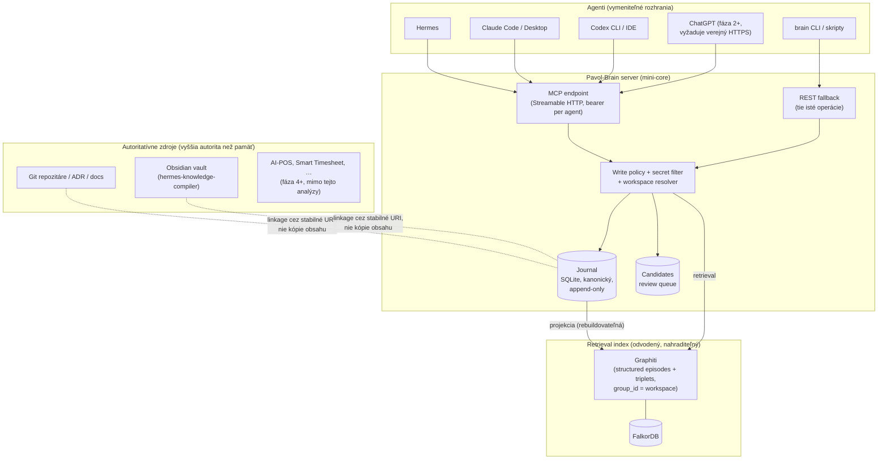
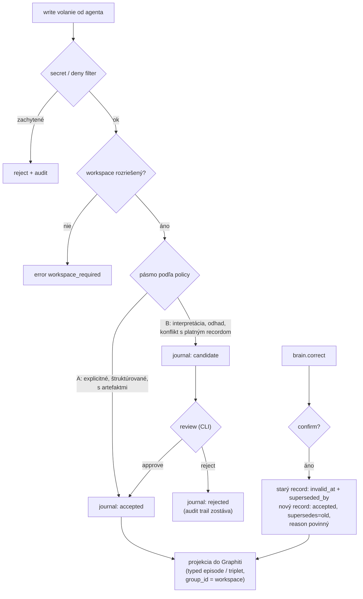
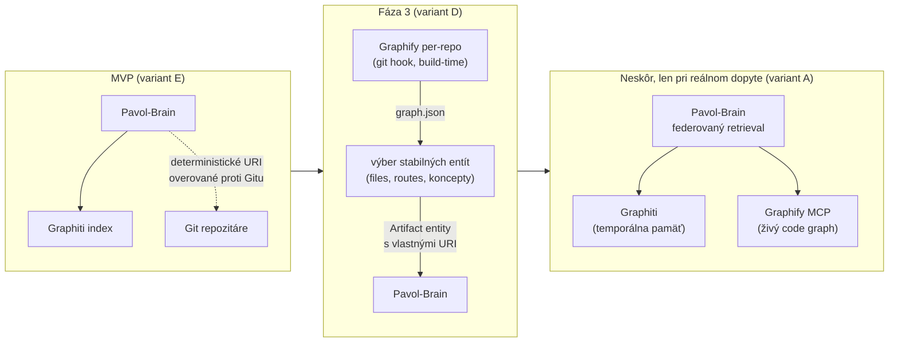
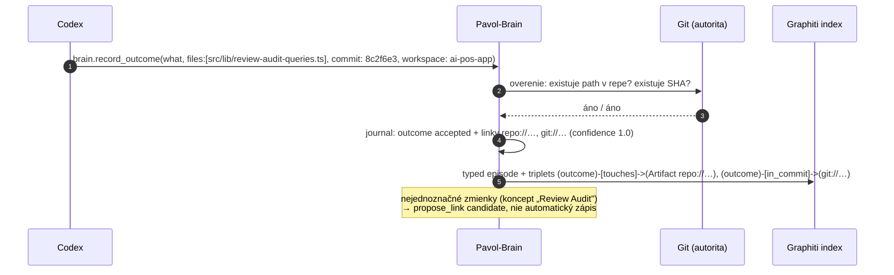
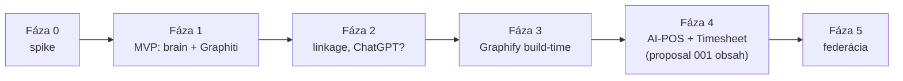

# Proposal 002: Pavol-Brain — Shared Memory and Knowledge Graph

- **Status:** Updated after Graphiti spike — SQLite retrieval selected
- **Dátum:** 2026-07-10
- **Autor:** Claude (Fable 5) na základe spresneného zadania Pavla Pavlovského
- **Nahrádza zameranie:** [Proposal 001](001-shared-ai-gateway-and-pavol-brain.md) zostáva ako historický vstup; jeho predpoklad „MVP = gateway k AI-POS a Smart Timesheet" **už neplatí**. Doménové integrácie sú teraz neskoršia fáza, nie kritická cesta.
- **Názov projektu:** `pavol-brain` (pozri §26; priečinok je premenovaný)

---

## 1. Executive summary

Cieľ sa spresnil: **najprv jeden spoločný mozog pre všetkých agentov, až potom nástroje a ruky.** Táto analýza odpovedá na otázku: *aká je najmenšia dôveryhodná architektúra, ktorá spojí temporálnu pamäť, projektové znalosti a stabilné artifact linkage — bez krehkého dvojitého knowledge graphu?*

Odporúčaná odpoveď v jednej vete:

> **Tenký Pavol-Brain MCP server s vlastným kanonickým SQLite journalom (typed records, provenance, workspace) + SQLite FTS5 a embeddings/vector retrieval s metadata/workspace/time filtrami a deterministickým merge/rankingom.**

> **Spike update:** [Proposal 004](004-graphiti-spike-architecture-review.md) a `spike/DECISION.md` uzavreli Graphiti 0.29.2 ako **NO** pre aktuálny lokálny structured-output stack. Journal-first architektúra zostáva; Graphiti nie je aktívny MVP retrieval backend.

Kľúčové závery rešerše (primárne zdroje, overené 2026-07-10):

1. **Graphiti je vhodný backend, ale nie autorita.** Bi-temporálny model (`valid_at`/`invalid_at`), invalidácia faktov, hybridný retrieval, `group_id` izolácia, custom entity types a MCP server 1.0 pokrývajú scenáre 1, 3 a 4 takmer hotovo. Slabiny: LLM-extrakcia môže halucinovať hrany, dedup je nespoľahlivý na malých modeloch, chýba natívny export/backup, a bez vlastnej vrstvy nemá review stavy ani písanú write policy. Preto Graphiti **nesmie byť kanonický zdroj** — tým je náš journal, z ktorého sa graf dá kedykoľvek prestavať.
2. **Graphify je reálny a prekvapivo solídny projekt** (deterministická tree-sitter extrakcia, confidence tagy EXTRACTED/INFERRED/AMBIGUOUS, MCP server, denná údržba, MIT) — ale je to **mapa kódu, nie pamäť**, je vo verzii 0.9.x s denným API churnom, a jeho hodnota patrí coding agentom v konkrétnom repe, nie centrálnemu mozgu. Hypotéza „Graphify + Graphiti sa dopĺňajú" **platí koncepčne, ale nie ako MVP integrácia** — spojenie cez zdieľaný backend (variant C) alebo import code grafu do Graphiti (variant B) by vytvorilo presne ten nespoľahlivý dvojitý graf, ktorému sa chceme vyhnúť.
3. **Hotové riešenie neexistuje.** Najbližšie je RedPlanetHQ CORE („Personal AI OS", temporálny KG + MCP), ale je mladé, ťažké (8 GB RAM), AGPL, bez review-first politiky a s marketingovými benchmarkmi. Mem0/OpenMemory a supermemory sú ploché pamäte bez serióznej temporality. Cognee je zaujímavý ETL-do-grafu engine, nie review-first osobný mozog. Obsidian vault zostáva ľudskou znalostnou vrstvou, nie pamäťovým backendom.
4. **Najväčšie riziko nie je technológia, ale šum:** pamäť plná neoverených, duplicitných alebo halucinovných záznamov zabije dôveru rýchlejšie než výpadok. Preto je jadrom návrhu write policy (priamy zápis / candidate / zakázané) a pravidlo autority: **aktuálny kód a autoritatívne dokumenty > odvodená pamäť.**

MVP: ~2–3 týždne práce, 2 kontajnery na mini-core (brain server + FalkorDB), 12 nástrojov, žiadny dashboard, žiadne doménové integrácie, merateľné acceptance a kill kritériá po 4 týždňoch.

## 2. Corrected problem statement

Proposal 001 riešil „spoločný prístup k doménovým aplikáciám". Spresnené zadanie hovorí: primárny problém je **fragmentovaná pamäť agentov**, nie prístup k aplikáciám.

Dnes:

- Hermes, Claude, Codex a ChatGPT majú každý vlastnú pamäť (Hermes profily, Claude memory súbory, ChatGPT memory, Codex nič trvalé).
- Rozhodnutie vyslovené v jednej konverzácii je pre ostatných agentov neviditeľné.
- Outcome práce Codexu žije len v transkripte tej session.
- Korekcia faktu v jednom agentovi nechá starú verziu žiť vo všetkých ostatných.
- Kontext projektu musím opakovať pri každom prepnutí agenta.

To má dva systémové dôsledky:

1. **Znalosť viazaná na runtime umiera s runtime** — presne problém, ktorý ADR 0012 v AI-POS pomenoval a vyriešil pre analyzer knowledge; teraz ho treba vyriešiť pre *interakčnú pamäť* všetkých agentov.
2. **Neexistuje pokračovateľnosť práce medzi agentmi** — handoff je vždy manuálny (copy-paste kontextu).

Čo problém **nie je** (a preto to nie je v MVP): prístup k živým commitments, time entries, e-mailom. Tie majú svoje autoritatívne aplikácie a prídu ako neskoršie „ruky".

## 3. Vision: one Pavol-Brain, many agents

> Agent je vymeniteľné používateľské rozhranie k tomu istému mozgu.

Každý agent cez rovnaké stabilné rozhranie vie:

- vyhľadávať v rovnakej pamäti (`brain.search`),
- získať relevantný projektový kontext (`brain.get_context`),
- uložiť potvrdené rozhodnutie (`brain.record_decision`),
- uložiť outcome vykonanej práce s väzbou na artefakty (`brain.record_outcome`),
- opraviť alebo nahradiť staré informácie so zachovaním histórie (`brain.correct`),
- vidieť provenance každej informácie (kto, kedy, cez koho, v akom workspace),
- pracovať len v relevantnom scope,
- pokračovať v práci začatej iným agentom.

Dlhodobo je Pavol-Brain jadrom **Pavol AI-OS**; AI-POS, Smart Timesheet, GitHub, homelab, Outlook a SAP sa pripájajú **až potom** — ako autoritatívne zdroje, ktoré brain číta, a ako ciele doménových nástrojov (to je miesto, kam sa vracia obsah proposalu 001).

Princíp: **najprv spoločný mozog, potom nástroje a ruky.**

## 4. Non-goals

- ❌ Integrácia AI-POS, Smart Timesheet, Outlooku, SAP — nie je v MVP ani na kritickej ceste.
- ❌ Automatické ukladanie konverzácií, transkriptov alebo chain-of-thought.
- ❌ Dashboard / UI (review kandidátov ide cez CLI).
- ❌ Veľký framework, event bus, model routing, orchestrácia agentov.
- ❌ Jeden fyzický „supergraf" všetkého — explicitne odmietame predpoklad, že jeden graf je lepší než oddelené zdroje s jasnou autoritou.
- ❌ Graphify ako súčasť MVP.
- ❌ Multi-user; systém je single-user.
- ❌ Náhrada Obsidian vaultu alebo hermes-knowledge-compiler — vault zostáva ľudskou znalostnou vrstvou.
- ❌ Kubernetes, cloud hosting — všetko beží na mini-core.

## 5. Terminology

| Pojem | Význam |
|---|---|
| **Pavol-Brain** | Spoločná pamäťová služba: tenký MCP/REST server + kanonický journal + retrieval index. Jediné rozhranie agentov k pamäti. |
| **Journal** | Append-only kanonický záznam všetkých prijatých memory records (SQLite). Zdroj pravdy; graf sa z neho dá prestavať. |
| **Retrieval index** | Odvodená vyhľadávacia vrstva (Graphiti nad FalkorDB). Nie je autorita; je nahraditeľná. |
| **Record** | Typovaná jednotka pamäte: `decision`, `outcome`, `fact`, `preference`, `correction`, `link`. |
| **Candidate** | Record čakajúci na review; nezúčastňuje sa bežného retrievalu (len explicitne). |
| **Artifact** | Stabilne identifikovaný projektový objekt: súbor, commit, route, ADR, dokument (`repo://…`, `git://…`, …). |
| **Workspace** | Pomenovaný scope (`pavol-brain`, `ai-pos-app`, `sap-work`, …); mapuje sa na Graphiti `group_id`. |
| **Provenance** | Metadáta pôvodu recordu: user, agent, workspace, session ref, čas, typ, zdroj, confidence, review stav, artifact refs, supersedes. |
| **Autoritatívny zdroj** | Živý systém vlastniaci doménu (kód v Git, ADR v repo, neskôr AI-POS). **Vždy prebíja pamäť.** |
| **Štrukturálny index** | Odvodená mapa artefaktov (neskôr Graphify graph.json). Nie autorita, nie pamäť. |
| **Agent memory** | Interakčná pamäť v Pavol-Brain. Tretia, najnižšia úroveň autority. |

Kotva celého návrhu (zopakovaná, lebo je to najdôležitejšia veta):

> **Aktuálny zdrojový kód a autoritatívne dokumenty majú vyššiu autoritu než odvodená pamäť.** Pamäť hovorí „toto sme vedeli/rozhodli vtedy"; kód a docs hovoria „toto platí teraz". Pri konflikte agent verí kódu a docs — a rozpor nahlási ako korekčný candidate.

## 6. User scenarios

**S1 — rozhodnutie medzi agentmi.** Hermes: „Pre projekt Pavol-Brain sme sa rozhodli, že pamäť musí byť nezávislá od konkrétneho agenta." → `brain.record_decision`. Neskôr Claude: „Aké základné rozhodnutia máme pre Pavol-Brain?" → `brain.search(workspace=pavol-brain, type=decision)` vráti record vrátane workspace, času, zdroja, agenta (hermes), typu, platnosti a review úrovne.

**S2 — outcome práce.** Codex dokončí prácu a uloží štruktúrovaný outcome: čo bolo implementované, zmenené súbory/artefakty, prejdené testy, otvorené otázky, commit SHA. Hermes/Claude sa neskôr spýta „čo sa v projekte naposledy zmenilo?" → `brain.get_recent(workspace=…)` vráti outcome bez čítania Codex konverzácie.

**S3 — korekcia a temporalita.** Uložené: „Pavol-Brain bude implementovaný vo FastMCP." Neskôr `brain.correct`: „…pomocou TypeScript MCP SDK", dôvod: „zjednotenie stacku". Systém: starý fakt dostane `invalid_at` + `superseded_by`, história a dôvod sa zachovajú, bežný retrieval vráti len aktuálnu verziu, historická otázka („čo platilo v júni?") vráti pôvodný fakt s vyznačenou neplatnosťou.

**S4 — workspace izolácia a prepojenie.** Record má primárny workspace. Vyhľadávanie: jeden workspace / explicitný zoznam / primárny + `related` / + `global` podľa policy. `sap-work` (sensitive) sa **nikdy** nepridáva implicitne.

**S5 — kombinovaný kontext.** Agent pri štarte práce zavolá `brain.get_context(workspace=ai-pos-app)` a dostane kompaktný balík: aktívne platné decisions, posledné outcomes, kľúčové preferences, súvisiace artefakty — bez čítania histórie.

**S6 — artifact linkage.** Outcome z S2 je deterministicky prepojený na `repo://ai-pos-app/src/lib/review-audit-queries.ts` a `git://ai-pos-app/commit/<sha>`; opačná otázka „čo sa týkalo tohto súboru?" vráti outcome aj súvisiace decision.

**S7 — vysvetliteľnosť.** `brain.explain_result(id)` ukáže: prečo bol record vrátený (zhoda vo fulltexte/embeddingu/grafovej blízkosti), jeho provenance a platnosť.

## 7. Required capabilities

Z scenárov vyplýva minimálna množina schopností:

1. **Typed records** so schémou per typ (decision/outcome/fact/preference/correction/link) — žiadny voľný text bez typu.
2. **Provenance** na každom recorde (§11).
3. **Temporalita**: `valid_at`, `invalid_at`, `supersedes`, dôvod zmeny; retrieval defaultne len platné.
4. **Workspace izolácia** + explicitné multi-workspace čítanie + sensitive ochrana.
5. **Hybridný retrieval**: sémantický + fulltext + entity/graph blízkosť; deterministické filtre (typ, workspace, čas) vždy prebíjajú skóre.
6. **Artifact identity + linkage** (deterministické URI, confidence úrovne, review pre neisté linky).
7. **Write policy** s tromi pásmami (priamy / candidate / zakázaný) a secret filtrom.
8. **Auditovateľnosť a vysvetliteľnosť** (journal + explain).
9. **Exportovateľnosť a rebuild**: journal je čitateľný formát; index sa dá zmazať a prestavať.
10. **Prevádzka na mini-core**: ≤2 kontajnery, ≤2 GB RAM, prežije reštart, zálohovateľné súbormi.

## 8. Agent integration architecture



Zásady:

1. **Agenti nikdy nevolajú Graphiti (ani FalkorDB, ani neskôr Graphify) priamo.** Vidia len úzke `brain.*`/`workspace.*` nástroje. Interné backendy sú skryté a vymeniteľné — to je definícia „stabilného rozhrania", ktoré prežije výmenu agenta aj výmenu backendu.
2. **Jeden server, dva transporty:** MCP (Streamable HTTP + bearer token per agent) primárne; REST (`POST /v1/tools/<name>`) generovaný z tej istej tool registry pre agentov bez spoľahlivého MCP a pre CLI. (Platí zistenie z 001: Claude aj Codex zvládnu remote MCP; Hermes treba overiť, fallback je REST; ChatGPT vyžaduje verejný HTTPS + OAuth → až po samostatnom go/no-go.)
3. **Identita agenta z tokenu, nie z parametra** (prevzaté z 001 — model si identitu nemôže vymyslieť).
4. **Journal-first write path:** každý prijatý zápis ide najprv do journalu (transakčne), potom sa asynchrónne projektuje do Graphiti. Ak projekcia zlyhá, journal je pravda a projekcia sa zopakuje — retrieval môže byť chvíľu neúplný, ale nikdy sa nič nestratí.

### Katalóg nástrojov

| Nástroj | Trieda | Poznámka |
|---|---|---|
| `workspace.list` / `workspace.current` / `workspace.related` | read | registry + efektívny scope + related väzby |
| `workspace.activate` | session write | default per agent session, expiruje |
| `brain.search` | read | query + filtre (workspaces[], types[], time range, include_invalid, include_candidates=false) |
| `brain.get_context` | read | kompaktný balík pre workspace (S5) |
| `brain.get_recent` | read | posledné records per workspace/typ (S2) |
| `brain.get_entity` | read | entita + platné fakty + timeline odkaz |
| `brain.get_timeline` | read | história entity/faktu vrátane superseded verzií (S3 historická otázka) |
| `brain.get_artifact_context` | read | records viazané na artifact URI (S6 opačný smer) |
| `brain.remember` | write / candidate | generický typed zápis; policy rozhodne pásmo (§10) |
| `brain.record_decision` | write | štruktúrovaná schéma: statement, rationale, workspace, artifacts[] |
| `brain.record_outcome` | write | schéma: what, artifacts[], tests, open_questions, commit |
| `brain.correct` | write-confirm | supersede: target id, nový obsah, dôvod (S3) |
| `brain.link_artifact` | write | len deterministické URI (inak odmietne → propose_link) |
| `brain.propose_link` | candidate | neistý link → review queue |
| `brain.forget` | destructive | dvojkrokové potvrdenie; tombstone v journale (nikdy tichý delete) |
| `brain.health` / `brain.sources` / `brain.explain_result` | read | diagnostika, zoznam backendov a ich stavu, vysvetlenie výsledku (S7) |

Poznámka k `brain.explain_result` — poctivé obmedzenie: Graphiti nevracia per-výsledok rozpis skórovania. Explain preto skladá: (a) provenance z journalu, (b) ktoré deterministické filtre prešli, (c) ktorá vyhľadávacia dráha record našla (fulltext zhoda / embedding similarity / graph sused), (d) platnosť. To je vysvetliteľné „prečo je to relevantné", nie matematický audit skóre — a pre účel (dôvera používateľa) to stačí.

## 9. Workspace and scope model

Preberá sa hybridný model z 001 (osvedčené rozhodnutie, tu len potvrdené a doplnené):

1. voliteľný explicitný `workspace` parameter na každom volaní (validovaný),
2. session default per agent (`workspace.activate`, expirácia 8 h), **nikdy globálny mutable stav**,
3. **write bez rozriešeného workspace zlyhá** (`workspace_required`),
4. read môže explicitne zadať viac workspace-ov,
5. `global` sa do čítania pridáva podľa policy (default áno pre preferences, nie pre decisions),
6. **sensitive workspace sa nikdy nepridáva implicitne** — ani cez related, ani cez global; len explicitne a len agentom s flagom `sensitive_allowed`.

### Hierarchia vs. related_to

Zadanie navrhuje hierarchiu (`ai-os → pavol-brain`; `ai-pos → ai-pos-app`). **Odporúčam hierarchiu zamietnuť** a použiť plochý `related_to` graf:

- Hierarchia si vynúti dedičné pravidlá (dedí sa retrieval? zápis? sensitivity?) — každé je nová komplexita a nový zdroj prekvapení. Skúsenosť s multi-tenant systémami: stromy scope-ov sa vžda zvrhnú na výnimky.
- Reálne potreby („keď hľadám v ai-pos-app, chcem vidieť aj ai-pos rozhodnutia") pokryje symetrická/asymetrická `related_to` väzba s explicitným smerom čítania.
- Graphiti `group_id` je plochý namespace — hierarchia by aj tak žila len v našej vrstve a musela by sa rozbaľovať na zoznam group_ids. `related_to` je presne to rozbalenie, bez ilúzie stromu.

```yaml
# workspaces.yaml
workspaces:
  - id: pavol-brain
    reads_from: [global]                 # jednosmerné: čítanie zahrnie aj tieto
  - id: ai-pos-app
    reads_from: [ai-pos, global]
  - id: sap-work
    sensitivity: sensitive               # nikdy implicitne; explicit-only
  - id: global
    write_policy: confirm                # zápis do global vždy s potvrdením
```

Mapovanie na Graphiti: **1 workspace = 1 `group_id`**. Multi-workspace čítanie = fan-out na zoznam group_ids v query (Graphiti search group_ids parameter). Izolácia je teda vynútená backendom, nie len konvenciou — a brain server je jediný, kto zoznam group_ids skladá, takže policy (sensitive, related) sa nedá obísť z klienta.

## 10. Write and review policy

Tri pásma, rozhoduje ich server (nie dobrá vôľa agenta):

**A — priamy zápis** (record je hneď `accepted`, ide do journalu aj indexu):

- explicitná používateľská požiadavka „zapamätaj si" (agent to deklaruje polom `user_requested: true`; nepravdivá deklarácia je zistiteľná z auditu a je to disciplinárny problém konfigurácie agenta, nie architektúry),
- `brain.record_decision` s vyplneným statement + rationale (potvrdené rozhodnutie),
- štruktúrovaný výsledok nástroja (výstup so schémou, napr. výsledok testov),
- `brain.record_outcome` s overiteľnými artefaktmi (aspoň jeden deterministický artifact URI alebo commit SHA).

**B — candidate** (ide do journalu so stavom `candidate`, do bežného retrievalu **nie**):

- agentova interpretácia („z konverzácie vyplýva, že…"),
- implicitné rozhodnutie (nikto nepovedal „rozhodli sme sa"),
- odhadovaná preferencia,
- neistý semantic link (`brain.propose_link`),
- **konflikt s existujúcim platným recordom** — namiesto tichého prepisu vznikne korekčný candidate; supersede vykoná až review alebo explicitný `brain.correct`.

Review: `brain candidates list/approve/reject` cez CLI (MVP). Approve = record prejde do `accepted` + projekcia do indexu; reject = zostáva v journale ako `rejected` (audit), z indexu nič.

**C — zakázaný zápis** (server odmietne, zaloguje):

- celé konverzácie/transkripty, chain-of-thought,
- tajomstvá: tokeny, heslá, API kľúče (regex + entropy filter na všetkých write nástrojoch),
- technický šum (stack traces, logy) mimo štruktúrovaného outcome poľa,
- neoverené hypotézy deklarované ako `fact`,
- citlivé osobné/pracovné údaje bez `sensitivity` flagu a mimo sensitive workspace.



## 11. Provenance model

Každý record v journale (kanonická schéma; Graphiti dostáva projekciu):

```jsonc
{
  "id": "rec_01J…",                 // ULID
  "type": "decision",               // decision | outcome | fact | preference | correction | link
  "status": "accepted",             // accepted | candidate | rejected | superseded | forgotten(tombstone)
  "workspace": "pavol-brain",
  "statement": "Pamäť musí byť nezávislá od konkrétneho agenta.",
  "body": { /* typed payload podľa schémy typu */ },
  "provenance": {
    "user": "pavol",
    "agent": "hermes",              // z tokenu, nie z parametra
    "session_ref": "mcp-sess-…",    // alebo conversation ref, ak ho agent poslal
    "recorded_at": "2026-07-10T10:00:00+02:00",
    "source": "user_statement",     // user_statement | tool_result | agent_inference | import
    "confidence": 1.0,              // 1.0 pre pásmo A; <1.0 pre candidates
    "review": "auto_accepted"       // auto_accepted | human_approved | pending | rejected
  },
  "temporal": {
    "valid_at": "2026-07-10T10:00:00+02:00",
    "invalid_at": null,
    "supersedes": null,             // rec_id starého recordu
    "superseded_by": null,
    "change_reason": null
  },
  "artifacts": [
    "workspace://pavol-brain",
    "repo://pavol-brain/docs/proposals/002-….md"
  ]
}
```

Projekcia do Graphiti: record → typed episode (JSON source) s `reference_time = valid_at`, `group_id = workspace`, `source_description = JSON(provenance)`; jednoznačné vzťahy (decision→artifact, outcome→commit) navyše ako explicitné triplets, aby graf mal deterministickú kostru nezávislú od LLM extrakcie. `rec_id` sa ukladá do episode metadát — spätná väzba index→journal je vždy možná.

## 12. Graphiti deep assessment

Zdroj: [getzep/graphiti](https://github.com/getzep/graphiti) (28.6k★, Apache-2.0, push denne) + [MCP server README](https://github.com/getzep/graphiti/blob/main/mcp_server/README.md) + [oficiálne docs](https://help.getzep.com/graphiti/getting-started/welcome).

**Čo Graphiti rieši hotové (a dobre):**

| Schopnosť | Stav | Poznámka pre nás |
|---|---|---|
| Temporálny model | ✅ bi-temporálny: event time (`reference_time`) + `valid_at`/`invalid_at` na faktoch | jadro scenára S3 |
| Superseding/invalidácia | ✅ nové poznatky invalidujú staré fakty; historické query cez date-range | presne „nahradiť, nie zmazať" |
| Epizódy | ✅ text/JSON/message epizódy, sagy so sekvenciou, provenance episode→entity (`get_episode_entities`) | naše records = JSON epizódy |
| Entity + edges/facts | ✅ entity s custom typmi (built-in: Preference, Requirement, Procedure, Event, Person, Document…), fakty na hranách | custom typy: Decision, Outcome, Artifact, Concept |
| Hybridný retrieval | ✅ embedding + BM25 + graph traversal, center_node reranking | S1, S5 |
| Izolácia | ✅ `group_id` namespace na epizódach aj query | 1 workspace = 1 group_id |
| Explicitné fakty vs. LLM extrakcia | ✅ `add_triplet` (priame trojice) popri `add_memory` (extrakcia) | kľúč k MVP 4 režimu |
| Bulk ingest | ✅ async queue, `SEMAPHORE_LIMIT` | nepotrebné v MVP, dobré pre rebuild |
| MCP server | ✅ 1.0, 13 nástrojov, HTTP aj stdio, Docker (`zepai/knowledge-graph-mcp`) | my ho ale **nevystavíme agentom** — brain server volá graphiti-core ako knižnicu, príp. MCP interne |
| Databázy | ✅ Neo4j, FalkorDB (default), Amazon Neptune; Kuzu deprecated | FalkorDB pre mini-core |
| Lokálne LLM/embeddings | ✅ OpenAI-compatible endpointy (Ollama, LM Studio…), Sentence Transformers embeddings | s výhradou kvality (nižšie) |

**Čo by sme museli doprogramovať (a je to presne naša tenká vrstva):**

- write policy, candidates a review stavy — Graphiti nič také nemá,
- provenance schéma nad rámec `source_description` (review, confidence, agent identity z tokenu),
- workspace policy (related, sensitive, fan-out group_ids),
- kanonický journal + rebuild (Graphiti **nemá dokumentovaný export/backup** — zálohovať treba na úrovni DB dumpu alebo, lepšie, vlastného journalu),
- artifact URI schéma a deterministické linkage,
- explain vrstvu.

**Čo Graphiti komplikuje / riziká:**

1. **LLM extrakcia = hlavný zdroj šumu.** `add_memory` extrahuje entity a vzťahy modelom; dokumentácia sama priznáva, že dedup a štruktúrovaný výstup „varies on small or local models". Riziko hallucinated edges je reálne. *Mitigácia = režim MVP 4:* records posielame ako typed JSON epizódy s custom entity types (zúžená extrakcia) a deterministickú kostru (decision→artifact, outcome→commit) zapisujeme cez `add_triplet`. Extrakcii nechávame len to, kde pridáva hodnotu: prepojenie na koncepty a entity naprieč recordami.
2. **Prevádzková stopa:** FalkorDB kontajner (Redis-based, stovky MB RAM — na mini-core v pohode) + LLM volania pri každom ingest (§19 odhad nákladov). Neo4j by bol ťažší (JVM ~1 GB+) — netreba.
3. **Bez vlastného journalu žiadna exportovateľnosť** — vyriešené architektúrou journal-first; graf je jednorazovo prestaviteľný replayom journalu (rebuild skript je súčasť MVP acceptance).
4. **Idempotencia:** `add_memory` nie je idempotentné; opakovaný ingest = duplicitné epizódy. Brain server preto projektuje s vlastným `rec_id` a projekčným kurzorom (journal si pamätá, čo už bolo projektované).
5. **Smerovanie projektu:** Graphiti je podložie komerčného Zep; OSS jadro je zdravé a licencia Apache-2.0, ale treba počítať s tým, že roadmap ťahá Zep cloud. Lock-in riešime journalom, nie nádejou.

**Verdikt:** vhodný ako **retrieval index a temporálny engine už v MVP**, v prísne štruktúrovanom režime, za tenkou vlastnou vrstvou. Nevhodný ako kanonické úložisko a nevhodný v režime „nalievaj konverzácie, ono si to vyextrahuje".

## 13. Graphify deep assessment

Zdroj: [Graphify-Labs/graphify](https://github.com/Graphify-Labs/graphify) — overené priamo cez repo, API, commity, issues a releases (2026-07-10).

**Fakty (nie marketing):** MIT licencia, vznik 2026-04, Graphify Labs (YC S26), dominantný autor safishamsi (783 commitov; ďalší prispievatelia ≤20), release kadencia ~denne (v0.9.9→v0.9.11 za 3 dni; 157 releases), issues sú prevažne interné inžinierske (edge-case parsery, determinizmus ghost-node merge, manifest blind spots) — repo je **skutočné a kvalitne vedené**, nie fasáda. 81.5k★ za 3 mesiace zostáva anomálne rýchle (agresívny SEO/growth funnel okolo projektu je viditeľný), ale kód a vývojová disciplína sú reálne. Stars neberieme ako dôkaz kvality — commit história a issue kvalita áno.

**Čo Graphify je:** deterministický extraktor štruktúry projektov. Tree-sitter AST parsing (~36 jazykov, bez LLM, lokálne) → nodes (súbory, triedy, funkcie, moduly, koncepty) a edges (`calls`, `imports`, `inherits`…) s **confidence tagmi `EXTRACTED` / `INFERRED` / `AMBIGUOUS`**. Sémantický pass pre docs/PDF/obrázky/video volá konfigurovateľný LLM (vrátane Ollama = lokálne). Výstupy: `graph.json`, interaktívny `graph.html`, `GRAPH_REPORT.md`, voliteľne GraphML, Cypher (Neo4j/FalkorDB), Obsidian vault. Inkrementálne updaty (`--update`, git post-commit hook, AST-only bez API nákladov). MCP server (stdio aj HTTP, api-key) s nástrojmi `query_graph`, `get_node`, `get_neighbors`, `shortest_path`. Podpora ~20 asistentov vrátane Hermes, Claude Code, Codex.

**Kritické body:**

- **v0.9.x s denným churnom** — formáty a node ID schéma sa môžu meniť; stavať na nich centrálnu pamäť by znamenalo týždennú údržbu integrácie.
- **Stabilita node IDs pri rename/refaktoringu nie je garantovaná** — vlastné issues projektu (ghost-node merge determinizmus, homonymné symboly) ukazujú, že identita uzlov je živý problém. Pre nás: linkage sa **nesmie** viazať na Graphify node ID, len na naše vlastné URI (§15).
- **Žiadne embeddings** — čisto štrukturálny traversal. To je pre code graph správne, ale znamená to, že „semantic search v kóde" nerieši.
- **Bus factor 1** a mladá firma — existenčné riziko strednej úrovne; MIT licencia ho zmierňuje (fork-friendly), formát graph.json je čitateľný.
- Meeting notes a všeobecné dokumenty vie zjesť (semantic pass), ale to už je LLM extrakcia s nákladmi a šumom — presne to, čo v pamäti kontrolujeme policy; duplikovať to v druhom systéme nechceme.

**Verdikt:** dobrý **per-repo nástroj pre coding agentov** (tam, kde agent pracuje s kódom, si graph.json/MCP zapne lokálne — bez účasti Pavol-Brain). Ako komponent centrálneho mozgu **teraz nie**: mladé API, nestabilné ID, prekryv s tým, čo coding agent aj tak vie (pozri variant E).

## 14. Graphiti–Graphify complementarity analysis

Pracovná hypotéza zadania („Graphify = mapa toho, čo existuje; Graphiti = pamäť toho, čo sa stalo; Brain skladá oboje") je **koncepčne správna — potvrdzujeм ju ako dlhodobý model. Ako implementačný plán MVP ju vyvraciam:** kombinácia dvoch grafových systémov v prvej verzii je presne „komplikovaný a nespoľahlivý dvojitý knowledge graph" z hlavnej otázky. Rozhodujú detaily variantov:

**Variant A — dva oddelené grafy, federovaný retrieval.** Architektonicky najčistejší: každý graf má vlastnú autoritu, prepojenie len logické cez stabilné URI. Ale federovaný retrieval znamená: dva query engines, dva ranking modely (Graphiti hybrid vs. Graphify traversal), zlievanie výsledkov bez spoločného skóre, dva zdroje výpadkov. Pre MVP zbytočné; pre fázu 3+ **správny cieľový tvar**, ak sa code-graph otázky ukážu ako reálna potreba.

**Variant B — Graphify exportuje do Graphiti.** ❌ Zamietam. Graphiti dátový model (epizódy → LLM-extrahované entity/fakty s embeddingmi) je stavaný na desiatky až stovky výrokov, nie na desaťtisíce code nodes. Import code grafu by: (a) zahlcoval retrieval (každé hľadanie rozhodnutí by súperilo s funkciami a importmi), (b) generoval embedding náklady na tisíce uzlov bez úžitku, (c) vyžadoval trvalú synchronizáciu pri každom commite — stale graph garantovaný. Graphify sám nemá stabilné node IDs naprieč refaktoringmi, takže by sa väzby trhali.

**Variant C — spoločný Neo4j/FalkorDB backend, oddelené labels.** ❌ Zamietam najdôraznejšie. Zdieľaná databáza ≠ integrácia: schema kolízie pri upgrade ktorejkoľvek strany (Graphiti aj Graphify si spravujú vlastné indexy a constraints), nejasný ownership (kto smie mazať? kto migruje?), spoločný blast radius (vadný bulk import Graphify zhodí retrieval pamäte), a Cypher cez oba namespaces zvádza k „chytrým" queries, ktoré vytvoria závislosť na interných schémach oboch projektov súčasne. Toto je najistejšia cesta k nespoľahlivému dvojitému grafu.

**Variant D — Graphify ako build-time artefakt.** ✅ Odporúčaný *neskorší* integračný tvar (fáza 3): Graphify beží per-repo (git hook), produkuje `graph.json`; Brain z neho indexuje **len vybrané, stabilné entity** — súbory, routes, top-level koncepty — ako `Artifact` entity s našimi URI (nie Graphify node IDs). Detailný code graph sa pri coding otázkach číta priamo z Graphify výstupu (agent lokálne, alebo `brain.get_artifact_context` odkáže na graph.json). Žiadna živá synchronizácia, žiadny druhý query engine v Braine.

**Variant E — Graphify zatiaľ vôbec.** ✅ **Voľba pre MVP.** Poctivé posúdenie: coding agenti dnes majú Git, ripgrep, language servery, symbol indexy a vlastné repo-mapy; Claude Code a Codex si štruktúru projektu odvodia sami a **lepšie z aktuálneho kódu než zo včerajšieho grafu** (pravidlo autority!). Pre scenáre S1–S7 Graphify nie je potrebný: artifact linkage stojí na deterministických URI overiteľných priamo proti Gitu (existuje súbor? existuje commit?), nie na code grafe. Graphify pridáva hodnotu až pri otázkach typu „ktoré služby siahajú na túto tabuľku naprieč troma repozitármi" — tie v MVP scenároch nie sú.

**Záver komplementarity:** áno, dopĺňajú sa — ale **sekvenčne, nie súbežne**. MVP: len Graphiti (variant E pre Graphify). Fáza 3: variant D (build-time import vybraných artefaktov). Dlhodobo, len ak vznikne reálny dopyt po cross-repo štrukturálnych otázkach: variant A (federácia). Varianty B a C sa zamietajú natrvalo.



## 15. Automatic artifact linkage

### Stabilná identita artefaktov (nezávislá od Graphify aj Graphiti)

```
workspace://ai-pos-app
repo://ai-pos-app/src/lib/review-audit-queries.ts      # repo-relative canonical path
git://ai-pos-app/commit/8c2f6e3…                        # commit SHA
route://ai-pos-app/tools/review-audit                   # logické artefakty
adr://ai-pos/0012                                       # ADR podľa čísla
doc://vault/Projects/AI-POS/review-audit.md             # Obsidian vault nota
concept://ai-pos/review-audit                           # pomenovaný koncept (ľudsky spravovaný register)
```

Pravidlá: URI je jediná identita linku (nikdy holý názov súboru — `route.ts` existuje v každom Next.js repe stokrát); `repo://` je repo-alias + repo-relative path (aliasy v `repos.yaml` s lokálnou cestou a origin URL); rename súboru = nový URI + voliteľný `link(renamed_from)` record — históriu drží Git, nie my.

### Odstupňované linkage

| Úroveň | Vznik | Ukladá sa ako |
|---|---|---|
| **deterministický** | presná zhoda: path existuje v repe (overené `git cat-file`/fs), commit SHA existuje, ADR číslo existuje | `accepted` link, confidence 1.0, automaticky |
| **high-confidence odvodený** | jednoznačná zhoda pri neúplnom vstupe (unikátny basename v jedinom repe workspace-u; commit prefix s jedinou zhodou) | `accepted` link, confidence ~0.9, označený `derived` |
| **low-confidence candidate** | semantic/LLM návrh („Review Audit" ~ `review-audit-queries.ts`), nejednoznačná zhoda | `candidate` → review |
| **user-confirmed** | approve kandidáta alebo explicitný `brain.link_artifact` | `accepted`, review=human_approved |

**MVP automatizuje len deterministickú úroveň** (+ high-confidence s prísnym prahom unikátnosti). LLM-assisted candidate linking je fáza 2 — najprv treba vidieť, koľko linkov vôbec vzniká a či manuálne `link_artifact` nestačí. Automatika sa pridáva na dokázanú bolesť, nie preventívne.



### Opačný smer

- `brain.get_artifact_context("repo://ai-pos-app/src/lib/review-audit-queries.ts")` → outcomes a decisions viazané na súbor (S6),
- `brain.get_entity("Decision rec_…")` → implementačné artefakty cez `touches`/`implements` linky,
- `brain.get_context(workspace)` → aktuálne platné decisions + posledné outcomes + top artefakty; *štruktúru* projektu ale agent vždy číta z živého repa (autorita), nie z pamäte.

## 16. Alternative architectures

Zhrnutie posúdených tvarov (detail variantov A–E v §14):

| Tvar | Verdikt | Dôvod |
|---|---|---|
| Jeden supergraf (všetko v Graphiti) | ❌ | zahltenie, stale code graph, LLM náklady, nestabilné ID |
| Zdieľaný DB backend (variant C) | ❌ | schema kolízie, nejasná autorita, spoločný blast radius |
| Federácia dvoch grafov od začiatku (variant A hneď) | ❌ pre MVP | dvojnásobná zložitosť pred dôkazom hodnoty |
| Len plochý memory store bez grafu (čisté MVP 3) | ⚠️ legitímna záloha | najmenší, ale temporalitu, entity retrieval a supersede staviame sami; viď §20 |
| **Journal + Graphiti v štruktúrovanom režime, Graphify neskôr build-time** | ✅ | jediný živý graf, kanonická pravda mimo neho, rebuild možný, cesta k A/D otvorená |

## 17. Existing projects and build-vs-buy

Metadáta overené cez GitHub API 2026-07-10. Stars uvádzame len ako kontext, nie dôkaz kvality.

| Projekt | Čo rieši | Licencia / aktivita | Verdikt |
|---|---|---|---|
| [getzep/graphiti](https://github.com/getzep/graphiti) | temporálny KG pre agent memory, MCP 1.0 | Apache-2.0, 28.6k★, denne | **Komponent MVP** (retrieval index, §12) |
| [Graphify-Labs/graphify](https://github.com/Graphify-Labs/graphify) | deterministický code/docs knowledge graph, MCP | MIT, 81.5k★ (3 mesiace, brať s rezervou), denne, v0.9.x | **Fáza 3 build-time artefakt**; per-repo nástroj pre coding agentov už dnes (mimo Brain) |
| [RedPlanetHQ/core](https://github.com/RedPlanetHQ/core) („C.O.R.E. / Personal AI OS") | najbližší hotový „one brain, many agents": temporálny KG, MCP, 50+ konektorov, pluginy pre Claude Code/Codex | AGPL-3.0*, 1.9k★, vznik 2025-05, denne | **Nie ako základ**: 8 GB RAM nárok, žiadna review-first policy, nedokumentovaná DB architektúra a provenance, marketingové benchmarky, mladé. **Watchlist** — ideovo najbližší konkurent nášho návrhu; keby sme nechceli nič stavať, toto by bol experiment na vyskúšanie. |
| [mem0ai/mem0](https://github.com/mem0ai/mem0) + OpenMemory | ploché memories cez MCP, self-editing pri konfliktoch | Apache-2.0, 60.5k★, denne | ❌ ako mozog: bez typed records, slabá temporalita (self-edit prepisuje namiesto supersede s históriou), bez review. Inšpirácia pre UX. |
| [supermemoryai/supermemory](https://github.com/supermemoryai/supermemory) | memory API + MCP, fact extraction, contradiction resolution, selective forgetting | MIT, 28.3k★, denne | ❌ podobný profil ako Mem0; orientované na hosted API; kontradikcie rieši automaticky (my chceme review). Inšpirácia. |
| [letta-ai/letta](https://github.com/letta-ai/letta) (MemGPT) | stateful agent runtime — pamäť žije v Letta agentoch | Apache-2.0, 23.7k★ | ❌ nesprávny tvar: my chceme pamäť nezávislú od runtime; Letta je ďalší runtime. |
| [topoteretes/cognee](https://github.com/topoteretes/cognee) | ECL pipeline dokumenty→KG+vektory, 14 retrieval módov, MCP | Apache-2.0, 27.5k★, denne | ⚠️ najsilnejšia alternatíva ku Graphiti ako *engine*; ale je to ingest-ETL platforma (dávkové „cognify" nad korpusom), nie interakčná temporálna pamäť s invalidáciou faktov. Keby MVP zlyhalo na Graphiti kvalite, kandidát č. 2 na výmenu indexu (journal to umožní). |
| [HKUDS/LightRAG](https://github.com/HKUDS/LightRAG) / [microsoft/graphrag](https://github.com/microsoft/graphrag) | GraphRAG nad korpusom dokumentov | MIT, veľmi aktívne | ❌ iný problém: query-focused sumarizácia statického korpusu, nie priebežná pamäť s provenance a temporalitou. |
| [basicmachines-co/basic-memory](https://github.com/basicmachines-co/basic-memory) | Markdown/Obsidian-natívna pamäť cez MCP | AGPL-3.0, 3.4k★ | ⚠️ odpoveď na „prečo nie Obsidian ako pamäť": toto je najlepší pokus, a aj tak nemá temporalitu, supersede ani workspace policy. Vault zostáva ľudskou vrstvou; Brain môže notes linkovať cez `doc://`. |
| [CodeGraphContext](https://github.com/CodeGraphContext/CodeGraphContext) | MCP server indexujúci kód do Neo4j | MIT, 3.9k★ | ❌ pre nás: rieši to, čo Graphify, s ťažším backendom (Neo4j) a menšou zrelosťou. Potvrdzuje ale, že „code graph MCP" je živá kategória — variant A má budúcich kandidátov. |
| [modelcontextprotocol/servers → memory](https://github.com/modelcontextprotocol/servers) | referenčný KG memory server (JSON súbor) | MIT | ❌ hračka; užitočný ako referencia minimálneho tool dizajnu. |
| [FalkorDB](https://github.com/FalkorDB/FalkorDB) | graf DB (Redis-based, GraphBLAS) | source-available (nie OSI)*, 4.7k★ | infra komponent pod Graphiti; pre osobné self-host použitie bez problému; lock-in nízky (dáta prestaviteľné z journalu) |

\* licencie overiť pri implementácii; AGPL/SSPL sú pre osobné použitie v poriadku, vylučujú len niektoré formy redistribúcie.

**Build-vs-buy záver:** kategória „shared agent memory" je preplnená, ale **nikto nekombinuje: review-first write policy + typed records + bi-temporálny supersede + workspace policy + deterministické artifact URI + kanonický journal**. To je presne tá tenká vrstva, ktorú staviame (odhadom nízke tisíce riadkov); všetko ťažké pod ňou (graf, temporalita, hybrid search) kupujeme cez Graphiti. Odpoveď na otázku „existuje už niečo také / lepší spôsob než Obsidian+Graphiti+Graphify": **hotová apka nie** — CORE je najbližšie a neprešla by našimi požiadavkami na dôveru a prevádzku; Obsidian nie je pamäťový backend (žiadna temporalita/izolácia/API autorita) a má zostať tým, čím je; Graphify do mozgu nepatrí vôbec (len k moving agentom per-repo). Najlepší spôsob je malá vlastná vrstva nad jedným kupovaným engine.

## 18. Security and privacy

Model hrozieb sa oproti 001 posúva: už nechránime primárne doménové aplikácie, ale **koncentrovanú pamäť o všetkom** — tá je sama osebe najcitlivejšie aktívum.

1. **Sieť:** brain server + FalkorDB len na LAN/VPN (Tailscale). FalkorDB port nevystavený vôbec (len docker network). ChatGPT = jediný dôvod na verejný endpoint → samostatné go/no-go, nie MVP.
2. **AuthN/Z:** bearer token per agent; per-agent flagy (`sensitive_allowed`, `can_forget: false` pre všetkých okrem CLI). Destructive `brain.forget` len s dvojkrokovým potvrdením.
3. **Secrets filter** na každom write (regex + entropy); odmietnutie sa audituje.
4. **Oddelenie osobného a pracovného:** `sap-work` a podobné workspace = `sensitive`, explicit-only retrieval, nikdy v `get_context` iného workspace. Cloud agenti bez `sensitive_allowed` ich nevidia vôbec — policy vynucuje server, nie prompt.
5. **Privacy voči poskytovateľom:** všetko, čo brain vráti cloud agentovi, opúšťa dom — mitigácia je scope-ovanie (workspace filter, top-N, žiadne bulk exporty cez tools). Ingest LLM volania: obsah records ide do extrakčného modelu → pre sensitive workspace použiť lokálny model (Ollama) alebo extrakciu vypnúť (len triplets), konfigurovateľné per workspace.
6. **Right to forget:** `forget` zapíše tombstone do journalu a zmaže obsah z indexu; journal drží len fakt zmazania (nie pôvodný obsah — obsah sa pri forget prepíše redakciou). Kompromis medzi auditom a súkromím, explicitne zdokumentovaný.
7. **Zálohy šifrovane** mimo mini-core (existujúci backup vzor domácnosti), lebo journal = koncentrát citlivých dát.

## 19. Operational model on mini-core

- **Kontajnery (2):** `pavol-brain` (Node/TypeScript, MCP+REST, SQLite journal na volume) + `falkordb`. Docker Compose + Caddy, `restart: unless-stopped` — existujúci vzor zo smart-timesheet/ai-pos-app.
- **RAM odhad:** FalkorDB stovky MB pri našej veľkosti grafu (tisíce uzlov, nie milióny); brain server <200 MB. Mini-core to unesie bez zmeny.
- **LLM náklady ingestu:** písanie ~10–40 records/týždeň; každý record = 1 embedding + 1–3 extrakčné volania malého modelu (typed episode so zúženou extrakciou). Rádovo **jednotky dolárov mesačne** s mini-triedou cloud modelu; s Ollama lokálne 0 €, ale s priznaným rizikom horšej extrakcie/dedup (Graphiti docs to explicitne varujú). Odporúčanie: štart na cloud mini-modeli, lokálny model ako experiment na non-sensitive workspace.
- **Latencia retrievalu:** FalkorDB query desiatky ms + 1 embedding volanie (~100–300 ms cloud, ~50 ms lokálne) → `brain.search` pod 1 s, prijateľné pre interaktívne použitie.
- **Backup/restore:** nočný dump SQLite journalu (kanonický) + FalkorDB RDB snapshot (pohodlie). **Restore drill = replay journalu do čistej Graphiti** — rebuild skript je súčasť MVP a zároveň poistka proti lock-inu a schema driftu Graphiti upgradov.
- **Výpadok grafu:** journal-first zápis funguje ďalej (projekcia sa dobehne); read degraduje na journal fulltext (FTS5) s hlásením `degraded` v `brain.health`. Čistá degradácia, žiadna strata.
- **Upgrade politika:** Graphiti verziu pinovať; upgrade = staging rebuild z journalu + porovnanie počtu entít/faktov pred prepnutím.

## 20. Minimal MVP variants

Spoločný základ všetkých variantov: tenký brain server (MCP+REST, write policy, provenance, workspace, artifact URI, CLI review) — to je nemenná časť. Líšia sa backendom pamäte:

| | **MVP 1: čistý Graphiti** (add_memory na všetko) | **MVP 2: Graphiti + Graphify** | **MVP 3: SQLite + embeddings** | **MVP 4: Graphiti štruktúrovaný** (typed episodes + triplets) ✅ |
|---|---|---|---|---|
| Komponenty | 2 kontajnery | 3+ (brain, FalkorDB, Graphify pipeline per repo) | 1 kontajner | 2 kontajnery |
| Implementačná prácnosť | nízka–stredná | vysoká (federácia/import, sync grafu) | stredná (staviame supersede, entity view, hybrid search sami) | stredná |
| Prevádzková zložitosť | stredná | vysoká (stale code graph, ID drift, 0.9.x churn) | najnižšia | stredná |
| Kvalita retrievalu | dobrá, ale zašumená voľnou extrakciou | teoreticky najbohatšia, prakticky nekonzistentná | dostatočná pre stovky records (FTS+vektor+filtre), žiadny entity graph | dobrá a čistá (deterministická kostra + zúžená extrakcia) |
| Temporalita | ✅ natívna | ✅ natívna (v Graphiti časti) | ⚠️ staviame sami (supersede stĺpce — zvládnuteľné, ale naše) | ✅ natívna |
| Artifact linkage | cez triplets | + code graph (nepotrebný pre S1–S7) | ✅ vlastné linky (rovnaké URI) | ✅ triplets s vlastnými URI |
| Riziko šumu | **vysoké** (hallucinated edges z voľného textu) | najvyššie | najnižšie | nízke (extrakcia zúžená custom typmi, kostra deterministická) |
| Migrácia neskôr | — | — | journal umožní prejsť na Graphiti kedykoľvek | journal umožní odísť z Graphiti kedykoľvek |
| Riziko variantu | pamäť stratí dôveru | dvojitý graf = hlavné riziko celého projektu | „druhý systém syndróm": časom doprogramujeme horší Graphiti | závislosť na Graphiti kvalite so štruktúrovaným vstupom (miernejšia, overiť spike-om) |

## 21. Recommended MVP

**MVP 4 + kanonický journal** (architektúra §8). Prečo:

- S3 (temporalita/supersede) a entity-centrický retrieval dostávame hotové a odskúšané; v MVP 3 by sme ich stavali sami a to je presne tá časť, kde by „jednoduchý store" prestal byť jednoduchý.
- Riziko šumu — hlavnú slabinu Graphiti — riešime režimom použitia (typed episodes, custom entity types, deterministické triplets, žiadne konverzácie), nie dodatočným systémom.
- Journal robí Graphiti **vymeniteľným detailom**: keby spike ukázal zlú kvalitu, ten istý brain server s tými istými nástrojmi prepneme na MVP 3 backend (FTS5+sqlite-vec) bez zmeny rozhrania agentov. Toto je poistka, vďaka ktorej si voľbu Graphiti môžeme dovoliť urobiť rýchlo.
- **Týždeň 1 obsahuje go/no-go spike:** 30–50 reálnych records (ručne zozbierané rozhodnutia a outcomes z posledného mesiaca) → merať kvalitu extrakcie, dedup, retrieval relevanciu. Kritérium: ≥80 % správne extrahované entity, žiadna halucinovná hrana v deterministickej kostre, search vráti očakávaný record v top-3 pre 8/10 testových otázok. Neprejde → MVP 3 backend, rozhodnutie zapísať cez `brain.record_decision` (dogfooding od prvého dňa).

**MVP rozsah:** brain server (TypeScript, oficiálny MCP SDK; graphiti-core cez malý Python sidecar alebo interné volanie Graphiti MCP — rozhodnúť v tech dizajne), 12 nástrojov (§8 katalóg bez `propose_link` automatiky a bez `get_timeline` ak sa nestihne — S3 historickú otázku pokryje `include_invalid` filter v search), `workspaces.yaml`, `repos.yaml`, `agents.yaml`, journal + rebuild skript, CLI (`brain candidates`, `brain search`, `brain remember`), Docker Compose, klienti: Hermes, Claude Code, Codex. **Bez:** ChatGPT, Graphify, LLM-linkage, dashboardu, doménových integrácií.

Odhad: 2–3 týždne čistej práce vrátane spiku a konfigurácie klientov.

## 22. Phased roadmap

| Fáza | Obsah | Gate |
|---|---|---|
| **0. Spike (týždeň 1)** | Graphiti kvalita na štruktúrovaných records (§21 kritériá) | schválenie tohto proposalu |
| **1. MVP** | §21; overiť S1–S7 s Hermes + Claude + Codex | spike prešiel (inak MVP 3 backend) |
| **2. Kvalita a návyky** | LLM-assisted candidate linking (ak manuálne linky nestačia), `get_timeline`, ChatGPT go/no-go (verejný HTTPS + OAuth), ladenie get_context | 4 týždne používania + acceptance §23 |
| **3. Projektová štruktúra (variant D)** | Graphify build-time import vybraných artefaktov ako `Artifact` entity; `brain.get_artifact_context` obohatený | dokázaná potreba code-graph otázok (z reálnych zlyhaní retrievalu) |
| **4. Ruky (návrat k proposal 001)** | AI-POS a Smart Timesheet doménové nástroje cez ten istý server; commitments/decisions previazané s pamäťou | brain denne používaný; AI-POS API prerekvizita |
| **5. Federácia (variant A)** | živý Graphify MCP / ďalšie zdroje vo federovanom retrievale | len pri reálnom dopyte |



## 23. Acceptance criteria

Po 4 týždňoch reálnej prevádzky (merané z journalu/auditu, nie pocitovo):

1. **≥3 agenti** (Hermes, Claude, Codex) reálne píšu aj čítajú ten istý brain.
2. **Cross-agent použitie:** ≥5 prípadov, keď record zapísaný jedným agentom bol vrátený a použitý iným (S1, S2).
3. **Korekcie:** ≥3 vykonané supersede; bežný retrieval po nich nikdy nevráti starú verziu ako platnú (S3).
4. **Workspace:** žiadny zistený únik medzi workspace; žiadny record v zlom scope bez detekcie (S4); sensitive scope nikdy v implicitnom výsledku.
5. **Relevancia:** vzorka 20 reálnych `brain.search` → ≥70 % „očakávaný record v top-3"; menej ako 10 % výsledkov hodnotených ako šum.
6. **Linkage:** ≥5 outcomes deterministicky previazaných na artefakty; `get_artifact_context` aspoň raz reálne použitý (S6).
7. **Vysvetliteľnosť:** pre ľubovoľný výsledok vie `explain_result` ukázať provenance a dôvod zhody (S7).
8. **Menej opakovania:** ≥5 zapísaných konkrétnych situácií „nemusel som prenášať kontext".
9. **Údržba ≤1 h/týždeň** po stabilizácii; ingest náklady ≤10 €/mesiac.

## 24. Kill criteria

Freeze (zmraziť, zapísať retro, dáta zostávajú v journale) ak po 4 týždňoch:

- <10 write operácií/týždeň z bežnej práce (systém sa nepoužíva),
- >30 % memories hodnotených ako nerelevantné/chybné (pamäť stráca dôveru),
- ingest náklady alebo latencia neúnosné (>20 €/mes. alebo search >3 s trvalo),
- candidates queue rastie bez review 2 týždne po sebe (review je únosnosť systému — ak nefunguje, systém generuje dlh),
- >50 % linkov vyžaduje ručnú opravu,
- údržba >2 h/týždeň dva týždne po sebe,
- (fáza 3+) Graphify grafy trvalo stale / neudržateľné updaty → zrušiť fázu 3, nie celý systém.

Čiastočné zlyhanie ≠ celkové: ak zlyhá jeden agent (napr. Hermes MCP), systém beží s ostatnými; ak zlyhá Graphiti kvalita, mení sa backend, nie rozhranie.

## 25. Open questions

1. **Hermes MCP klient** — reálna podpora remote MCP (rovnaká otázka ako v 001, stále neoverená). Fallback REST je pripravený.
2. **Graphiti integrácia technicky:** graphiti-core je Python — TypeScript brain server ju volá cez malý Python sidecar (FastAPI), alebo interne cez Graphiti MCP server ako subprocess? (Alternatíva: celý brain server v Pythone/FastMCP — proti tomu hovorí jednotnosť stacku; rozhodnúť v tech dizajne, kritérium: čo je menej pohyblivých častí.)
3. **Embedding model:** cloud (OpenAI small) vs. lokálny (Sentence Transformers) — ovplyvňuje privacy aj kvalitu; možno per-workspace.
4. **`concept://` register:** kto spravuje zoznam pomenovaných konceptov — ručný YAML, alebo entity vznikajú voľne v Graphiti a register je len alias mapa? (Sklon: začať voľne, register pridať pri prvom konflikte mien.)
5. **Session ref od agentov:** vedia Hermes/Claude/Codex poslať stabilný conversation identifier? Ak nie, provenance drží len MCP session id.
6. **Obsidian vault linkage:** má `doc://vault/...` overovať existenciu noty (vault je lokálny na inom stroji?) — kde vault fyzicky žije vzhľadom na mini-core?
7. **ChatGPT (fáza 2):** rovnaké go/no-go ako v 001 — verejná expozícia koncentrovanej pamäte je citlivejšia než expozícia gateway; možno ChatGPT dostane len read-only token.
8. **Retention candidates:** po akom čase neprereviewované candidates expirujú? (Návrh: 30 dní → auto-reject s dôvodom `expired`.)
9. **Migrácia existujúcej znalosti:** jednorazový import — ADR z ai-pos, kľúčové rozhodnutia z pamäte Claude/Hermes profilov? (Sklon: áno, ručne kurátorovaný zoznam ~30–50 records ako spike dataset — dve muchy jednou ranou.)

## 26. Final recommendation

1. **Projekt je premenovaný na `pavol-brain`**. Pôvodný názov „ai-gateway" už nezodpovedal ťažisku — gateway k doménovým aplikáciám je fáza 4, nie identita projektu. Meno komponentu: Pavol-Brain server; Proposal 001 zostáva ako historický plán fázy 4.
2. **Schváliť architektúru: journal-first + SQLite FTS5 + embeddings/vector retrieval za tenkým MCP serverom** (MVP). Agenti nikdy nevidia backendy; kanonická pravda žije v journale; metadata/workspace/time filtering a typed links/supersede chains sa skladajú deterministicky.
3. **Graphify v MVP nepoužiť** (variant E), vo fáze 3 nanajvýš ako build-time artefakt (variant D). Varianty B a C (import do Graphiti / zdieľaný backend) natrvalo zamietnuť — to je presne ten nespoľahlivý dvojitý graf.
4. **Graphiti možno znovu vyhodnotiť** až pri významnejšej novej verzii alebo inom spoľahlivom lokálnom structured-output stacku — bez rozšírenia vlastného patch budgetu. Rozhranie agentov sa nemení.
5. **Merať 4 týždne, potom acceptance/kill** (§23–24). Doménové integrácie (AI-POS, Smart Timesheet) sa otvárajú až po úspechu — presne v duchu „najprv spoločný mozog, potom nástroje a ruky".

Po Graphiti spike-u je najmenšia dôveryhodná architektúra **kanonický SQLite journal s FTS5, embeddings/vector retrievalom a deterministickými typed links/supersede chains** pod tenkou vlastnou vrstvou. Všetko ostatné (code graf, doménové aplikácie, federácia) sa pripája neskôr cez stabilné URI — nie cez zdieľané databázy.

---

## Prílohy — zdroje

- Graphiti: [repo](https://github.com/getzep/graphiti) · [MCP server README](https://github.com/getzep/graphiti/blob/main/mcp_server/README.md) · [docs](https://help.getzep.com/graphiti/getting-started/welcome) · [LLM konfigurácia (Ollama/local)](https://help.getzep.com/graphiti/configuration/llm-configuration) · [FalkorDB integrácia](https://docs.falkordb.com/agentic-memory/graphiti.html)
- Graphify: [Graphify-Labs/graphify](https://github.com/Graphify-Labs/graphify) (README, commity, issues, releases overené priamo cez GitHub API 2026-07-10)
- Alternatívy: [RedPlanetHQ/core](https://github.com/RedPlanetHQ/core) · [mem0ai/mem0](https://github.com/mem0ai/mem0) · [supermemoryai/supermemory](https://github.com/supermemoryai/supermemory) · [letta-ai/letta](https://github.com/letta-ai/letta) · [topoteretes/cognee](https://github.com/topoteretes/cognee) · [HKUDS/LightRAG](https://github.com/HKUDS/LightRAG) · [microsoft/graphrag](https://github.com/microsoft/graphrag) · [basicmachines-co/basic-memory](https://github.com/basicmachines-co/basic-memory) · [CodeGraphContext](https://github.com/CodeGraphContext/CodeGraphContext) · [MCP reference memory server](https://github.com/modelcontextprotocol/servers)
- Prehľady kategórie (sekundárne, s rezervou): [Mem0 vs Letta vs Zep vs Cognee 2026](https://mcp.directory/blog/mem0-vs-letta-vs-zep-vs-cognee-2026) · [vectorize.io agent memory systems](https://vectorize.io/articles/best-ai-agent-memory-systems)
- Interné: [Proposal 001](001-shared-ai-gateway-and-pavol-brain.md) (klientská MCP matica, workspace hybrid model, mini-core deploy vzor) · `ai-pos/docs/adr/0012` (knowledge ownership — filozofický základ journal-first) · `ai-pos/docs/behavior-pack/10-hermes-integration.md` (ownership map, G-11 „konektory sú hlúpe")
