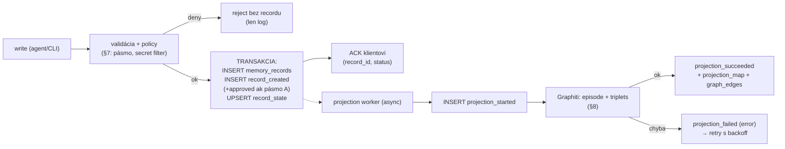
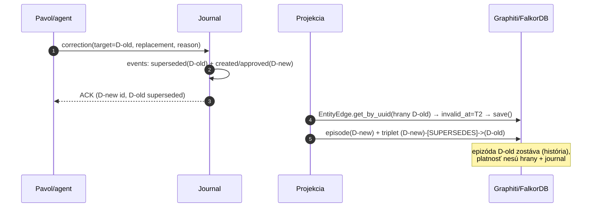
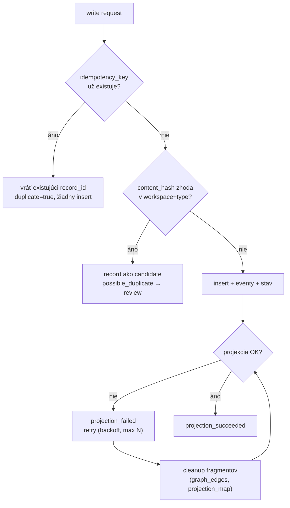
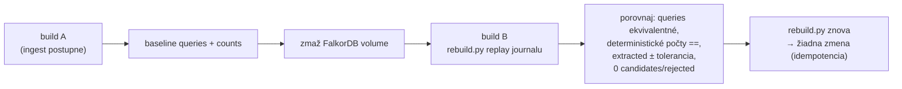

# Proposal 003: Graphiti Spike Design

- **Status:** Completed — NO
- **Dátum:** 2026-07-10
- **Autor:** Claude (Fable 5) na základe zadania Pavla Pavlovského
- **Nadväzuje na:** [Proposal 001](001-shared-ai-gateway-and-pavol-brain.md) (historický vstup, fáza 4+) · [Proposal 002](002-pavol-brain-shared-memory-and-knowledge-graph.md) (accepted in principle; Graphiti **nie je** definitívne schválený backend — o tom rozhodne tento spike)

---

> **Final result (2026-07-10):** N1 PASS; N2 PASS; simple local structured-output probe PASS. The final high-level ingest failed on complex `SummarizedEntities` structured output; N5 frozen patch budget and N6 stop rule were triggered. N3/N4 and the full benchmark are **NOT EVALUATED**. Final fallback: SQLite FTS5 + embeddings. See `spike/DECISION.md` and [Proposal 004](004-graphiti-spike-architecture-review.md).

## 1. Executive summary

Tento dokument je vykonávací plán go/no-go spiku s jedinou hlavnou otázkou:

> **Je Graphiti dostatočne presné, deterministické, rebuildovateľné a prevádzkovo rozumné ako odvodený retrieval index nad kanonickým Pavol-Brain journalom?**

Spike **nie je** mini-implementácia Pavol-Brain. Je to laboratórny experiment: ~60 kurátorovaných records z reálnych projektov, ~24 benchmark queries, sada deštruktívnych testov (supersede, duplicity, výpadky, rebuild z nuly) a tvrdé číselné prahy. Výstupom je `DECISION.md` s verdiktom GO / GO WITH CONDITIONS / NO → SQLite FTS5+embeddings fallback.

Kľúčové návrhové rozhodnutia tohto dokumentu:

1. **Skutočne append-only journal**: nemenné `memory_records` + append-only `memory_events`; aktuálny stav je materializovaná tabuľka `record_state` udržiavaná transakčne a kedykoľvek prepočítateľná z eventov (invariant sa testuje).
2. **Prísne oddelená projekcia**: deterministická kostra (record entity, artifact linky, supersede) cez `add_triplet` + priame CRUD; LLM extrakcia len na povolených textových poliach a len do povolených entity typov. Edge origin sa eviduje paralelne v journale (`graph_edges` registry), lebo Graphiti origin pole nemá.
3. **Explicitná deterministická invalidácia** cez graphiti-core CRUD (`EntityEdge.get_by_uuid` → `invalid_at`/`expired_at` → `save`) — nie LLM-driven invalidácia. Overenie tejto schopnosti je checkpoint dňa 1: ak nefunguje, je to samostatný silný signál proti Graphiti.
4. **Spike sa píše celý v Pythone (variant D)** — graphiti-core priamo ako knižnica, žiadny server, len CLI skripty. Minimalizuje vlastný kód, neprejudikuje produkčný stack (TypeScript vs. Python sa rozhodne až po spiku, informovane).
5. **A/B test cloud vs. lokálny LLM/embeddings** na identickom datasete — rozhodne, či sensitive workspaces môžu fungovať bez cloudu.

Kritický postoj: prahy sú nastavené tak, aby ich **zdravý systém splnil a chorý nie**. Ak Graphiti neprejde, fallback je pripravený a lacný — to je celý zmysel journal-first architektúry.

## 2. Scope

**V scope:**

- journal schéma (SQLite) + typed record schémy potrebné pre spike,
- projekcia journal → Graphiti (FalkorDB) vrátane supersede a idempotencie,
- kurátorovaný dataset ~60 records + ~24 queries s očakávaniami,
- vyhodnotenie: retrieval, temporalita, dedup, workspace izolácia, edge quality, rebuild, prevádzka,
- A/B: cloud vs. lokálny LLM/embedding,
- artifact URI validácia priamo proti lokálnym Git repozitárom,
- rozhodovací template.

**Mimo scope (potvrdené):** AI-POS, Smart Timesheet, Graphify, ChatGPT, dashboard, produkčná autentifikácia, kompletný MCP server, plný katalóg brain tools, automatické ukladanie konverzácií, Neo4j (bez konkrétneho dôvodu), viac než 2 LLM konfigurácie.

## 3. Fixed assumptions

Nasledujúce body sa v spiku **neotvárajú** (rozhodnuté v 002):

1. Kanonický zdroj pravdy je vlastný journal.
2. Graphiti je iba odvodený a kedykoľvek zmazateľný retrieval index.
3. Agenti nikdy nepristupujú ku Graphiti priamo.
4. Aktuálny kód a autoritatívne dokumenty > odvodená pamäť.
5. Graphify nie je súčasťou MVP ani spiku.
6. Žiadne celé konverzácie ani chain-of-thought.
7. Workspaces sú izolované (1 workspace = 1 `group_id`).
8. Deterministické a LLM-extrahované vzťahy sú vždy odlíšiteľné.
9. Index je úplne prestaviteľný z journalu.
10. Fallback pri NO: SQLite FTS5 + embeddings, bez zmeny budúceho agentného API.

## 4. Questions the spike must answer

| # | Otázka | Kde sa meria |
|---|---|---|
| Q1 | Nájde hybridný retrieval správny record spoľahlivo (top-1/top-3, aj cross-lingual)? | §12, §22 |
| Q2 | Funguje explicitná deterministická invalidácia a vracia current/historical query správne verzie? | §13 |
| Q3 | Je projekcia idempotentná (žiadne duplicitné epizódy pri retry/replay)? | §14 |
| Q4 | Držia candidates mimo bežného retrievalu? | §15 |
| Q5 | Je `group_id` izolácia tesná (0 leakov, žiadne nesprávne zlievanie entít naprieč workspace)? | §16 |
| Q6 | Aká je kvalita LLM-extrahovaných entít/hrán na štruktúrovaných records (precision, halucinácie)? | §17 |
| Q7 | Zvládne lokálny model extraction + embeddings v použiteľnej kvalite (→ sensitive bez cloudu)? | §18 |
| Q8 | Je FalkorDB na mini-core prevádzkovo v poriadku (RAM, latencia, výpadky)? | §19 |
| Q9 | Je rebuild z journalu úplný, skriptovaný a funkčne ekvivalentný? | §20 |
| Q10 | Ktoré graphiti-core API reálne potrebujeme → aký tenký môže byť produkčný šev? | §21 |

## 5. Journal/event model

Proposal 002 miešal „append-only" so stavmi na recorde. Čistý model: **record je nemenný, stav je dôsledok eventov.**

### 5.1 SQL schéma (SQLite, WAL)

```sql
PRAGMA journal_mode = WAL;

-- Nemenný pôvodný record. Po INSERT sa riadok NIKDY neupravuje.
-- Jediná výnimka: redaction pri forget (§5.4) — prepis payload/raw_input
-- redakčným markerom; všetko ostatné zostáva.
CREATE TABLE memory_records (
  record_id        TEXT PRIMARY KEY,            -- ULID
  schema_version   INTEGER NOT NULL DEFAULT 1,
  type             TEXT NOT NULL CHECK (type IN
                     ('decision','outcome','fact','correction','artifact_link','preference')),
  workspace        TEXT NOT NULL,               -- validované proti workspaces.yaml
  sensitivity      TEXT NOT NULL DEFAULT 'normal' CHECK (sensitivity IN ('normal','sensitive')),
  raw_input        TEXT NOT NULL,               -- JSON: presne to, čo prišlo od agenta/CLI
  payload          TEXT NOT NULL,               -- JSON: normalizovaný typed payload (§6)
  content_hash     TEXT NOT NULL,               -- sha256(canonical_json(type,workspace,payload))
  idempotency_key  TEXT NOT NULL UNIQUE,        -- klient dodá; inak server = content_hash
  -- provenance (nemenná časť)
  agent_id         TEXT NOT NULL,               -- z tokenu / CLI identity
  source_assertion TEXT NOT NULL CHECK (source_assertion IN
                     ('explicit_user_command','explicit_user_confirmation',
                      'verified_tool_result','authoritative_document',
                      'agent_inference','imported_curated')),
  source_excerpt   TEXT,                        -- krátky citát (≤500 znakov), voliteľný
  source_ref       TEXT,                        -- external ref alebo sha256 zdroja (dokument, tool output)
  session_ref      TEXT,
  confidence       REAL NOT NULL,               -- 0.0–1.0, priradené policy (§7), nie agentom
  -- temporalita udalosti, ktorú record tvrdí
  valid_at         TEXT NOT NULL,               -- ISO 8601; odkedy tvrdenie platí
  created_at       TEXT NOT NULL                -- kedy bol record zapísaný
);

CREATE INDEX idx_records_ws_type ON memory_records(workspace, type);
CREATE INDEX idx_records_hash    ON memory_records(content_hash);

-- Append-only udalosti. Nikdy UPDATE, nikdy DELETE.
CREATE TABLE memory_events (
  event_id    TEXT PRIMARY KEY,                 -- ULID (monotónne → poradie)
  record_id   TEXT NOT NULL REFERENCES memory_records(record_id),
  event_type  TEXT NOT NULL CHECK (event_type IN
                ('record_created','record_approved','record_rejected',
                 'record_superseded','record_forgotten',
                 'artifact_link_added','artifact_link_removed',
                 'projection_started','projection_succeeded','projection_failed')),
  occurred_at TEXT NOT NULL,
  actor       TEXT NOT NULL,                    -- agent_id | 'cli' | 'system'
  data        TEXT NOT NULL DEFAULT '{}'        -- JSON: reason, superseded_by, error,
                                                -- graphiti uuids, build_id, …
);

CREATE INDEX idx_events_record ON memory_events(record_id, event_id);

-- Materializovaný aktuálny stav (§5.2). Udržiavaný transakčne aplikáciou,
-- kedykoľvek prepočítateľný fold-om eventov. NIE je zdroj pravdy.
CREATE TABLE record_state (
  record_id        TEXT PRIMARY KEY REFERENCES memory_records(record_id),
  status           TEXT NOT NULL CHECK (status IN
                     ('candidate','accepted','rejected','superseded','forgotten')),
  review           TEXT NOT NULL CHECK (review IN
                     ('auto_accepted','human_approved','pending','rejected','expired')),
  invalid_at       TEXT,                        -- kedy tvrdenie prestalo platiť (supersede)
  supersedes       TEXT,                        -- record_id
  superseded_by    TEXT,                        -- record_id
  change_reason    TEXT,
  projection       TEXT NOT NULL DEFAULT 'none' CHECK (projection IN
                     ('none','pending','projected','failed','removed')),
  projection_error TEXT,                        -- posledná chyba (z posledného projection_failed)
  projected_build  TEXT,                        -- build_id indexu, do ktorého je record projektovaný
  updated_event_id TEXT NOT NULL                -- posledný event zapracovaný do stavu
);

-- Overené artifact linky (deterministické aj schválené). Append cez eventy,
-- táto tabuľka je materializácia pre rýchly lookup (get_artifact_context).
CREATE TABLE artifact_links (
  record_id   TEXT NOT NULL REFERENCES memory_records(record_id),
  artifact_uri TEXT NOT NULL,                   -- repo:// git:// adr:// route:// doc:// workspace://
  relation    TEXT NOT NULL,                    -- touches | implements | in_commit | about | renamed_from
  confidence  REAL NOT NULL,
  origin      TEXT NOT NULL CHECK (origin IN ('deterministic','derived','user_confirmed')),
  verified_at TEXT NOT NULL,                    -- kedy prebehla validácia proti Gitu
  active      INTEGER NOT NULL DEFAULT 1,       -- 0 po artifact_link_removed
  PRIMARY KEY (record_id, artifact_uri, relation)
);

-- Paralelná evidencia hrán v Graphiti (§8.5): origin každej hrany, ktorú sme
-- vytvorili deterministicky. Hrany mimo tejto tabuľky = extracted.
CREATE TABLE graph_edges (
  edge_uuid   TEXT PRIMARY KEY,                 -- Graphiti EntityEdge uuid
  record_id   TEXT NOT NULL,
  origin      TEXT NOT NULL CHECK (origin IN ('deterministic','explicit')),
  build_id    TEXT NOT NULL,
  created_at  TEXT NOT NULL
);

-- Mapovanie record → Graphiti episode (idempotencia projekcie, rebuild audit).
CREATE TABLE projection_map (
  record_id    TEXT NOT NULL,
  build_id     TEXT NOT NULL,                   -- identita indexu (nový pri každom rebuild)
  episode_uuid TEXT,                            -- NULL pre records bez epizódy (artifact_link)
  PRIMARY KEY (record_id, build_id)
);
```

### 5.2 Prečo materializovaná tabuľka, nie view ani app-only stav

- **SQL view** nad `memory_events` (latest-event fold) je v SQLite pre viacero stavových dimenzií (status × review × projection × supersede pointery) nečitateľný a pomalý na joiny; navyše fallback retrieval (§3 bod 10) potrebuje stav ako indexovateľné stĺpce.
- **App-only dopočítavanie** znamená, že stav nie je queryovateľný pre CLI/debug bez aplikačného kódu — zlé pre spike aj audit.
- **Materializovaná tabuľka** aktualizovaná v tej istej transakcii ako insert eventu dáva oboje. Invariant `record_state == fold(memory_events)` overuje skript `verify_state.py` (spustený v evaluácii) — tým je „materializácia" bezpečná a model zostáva event-sourced v malom, bez event-bus ambícií.

### 5.3 Stavový automat

`record_created` → `candidate` alebo `accepted` (podľa policy §7) → `record_approved`/`record_rejected` (len z `candidate`) → `record_superseded` (len z `accepted`; data: `superseded_by`, `reason`) → `record_forgotten` (z hociktorého; data: `reason`). Projection eventy sú ortogonálne (menia len `projection` stĺpce). Nelegálne prechody server odmieta (test v §23).

### 5.4 Forget vs. append-only

`record_forgotten` je event; obsah recordu sa **redakčne prepíše** (`payload`/`raw_input`/`source_excerpt` → `{"redacted": true, "reason_ref": event_id}`) a z Graphiti sa epizóda + hrany zmažú (CRUD delete). Je to jediná mutácia `memory_records` — vedomý kompromis privacy > puritanizmus, explicitne zdokumentovaný. Hash a metadáta zostávajú (audit, idempotencia).



Poznámka: ACK klientovi sa posiela **po journal transakcii, pred projekciou** — klient má pravdu potvrdenú; index dobieha. `brain.health` v spiku simuluje len `projection lag` metriku.

## 6. Record schemas

Spike potrebuje **5 typov**; `preference` je v schéme povolený, ale v spiku sa **netestuje** (správa sa ako `fact` so scope — nič nové by nedokázal; menší dataset > univerzálnosť).

**decision** (spike: áno)

```jsonc
{ "statement": "Pamäť musí byť nezávislá od konkrétneho agenta.",
  "rationale": "Znalosť viazaná na runtime umiera s runtime (ADR 0012).",
  "alternatives_considered": ["pamäť per agent s exportom"],   // voliteľné
  "decision_status": "accepted",     // accepted | proposed (proposed ⇒ record je candidate)
  "artifacts": ["adr://ai-pos/0012"] }
```

**outcome** (spike: áno)

```jsonc
{ "summary": "Review Audit implementovaný.",
  "changes": ["pridaná route /tools/review-audit", "query boundary review-audit-queries.ts"],
  "artifacts": ["repo://ai-pos-app/src/lib/review-audit-queries.ts",
                "route://ai-pos-app/tools/review-audit"],
  "commit": "git://ai-pos-app/commit/<sha>",   // voliteľné, validované
  "verification": { "tests": "pass", "lint": "pass", "typecheck": "pass", "build": "pass" },
  "open_questions": ["retention audit logu"] }
```

**fact** (spike: áno)

```jsonc
{ "subject": "mini-core", "predicate": "runs", "object": "OrbStack + Docker Compose, LAN/VPN only",
  "evidence": "smart-timesheet/docs/deployment-mac-mini.md" }
// validity nesie record: valid_at + record_state.invalid_at
```

**correction** (spike: áno — jadro S3)

```jsonc
{ "target_record": "rec_01J…",
  "replacement": { /* plný payload nového recordu toho istého typu */ },
  "reason": "Rozhodnutie zmenené kvôli jednotnému stacku." }
// Spracovanie: vznikne NOVÝ record (typ podľa replacement) + eventy
// record_superseded (starý) a record_created/approved (nový);
// correction record sám je nositeľ reason + väzby.
```

**artifact_link** (spike: áno)

```jsonc
{ "source_record": "rec_01J…", "artifact_uri": "repo://ai-pos-app/src/lib/review-audit-queries.ts",
  "relation": "touches", "origin_claim": "deterministic" }
// server origin_claim overí (§10); neoveriteľné ⇒ candidate (origin derived) alebo reject
```

**preference** (spike: nie — odložené do MVP)

## 7. Source assertion and trust model

`user_requested: true` (002) sa nahrádza enumom `source_assertion`:

| Assertion | Význam | Default policy | Confidence |
|---|---|---|---|
| `explicit_user_command` | používateľ výslovne prikázal zapísať („zapamätaj si…") | **auto-accept** | 1.0 |
| `explicit_user_confirmation` | používateľ potvrdil návrh agenta („áno, zapíš to tak") | **auto-accept** | 1.0 |
| `verified_tool_result` | štruktúrovaný výstup nástroja; pri outcome s artefaktmi vyžaduje ≥1 úspešne validované artifact URI alebo commit | **auto-accept** (bez validného artefaktu ⇒ candidate) | 0.95 |
| `authoritative_document` | tvrdenie doslova podložené dokumentom (ADR, README); `source_ref` povinný | **auto-accept** | 0.95 |
| `agent_inference` | interpretácia/odhad agenta | **vždy candidate** | ≤0.7 |
| `imported_curated` | jednorazový ručne kurátorovaný import (náš spike dataset) | **auto-accept**, review=`human_approved` | 1.0 |

Doplňujúce pravidlá:

- `confidence` priraďuje **server podľa assertion**, nie agent (agent ju môže len znížiť).
- `fact` s `agent_inference` nie je zakázaný — je candidate. Zakázané (reject, bez recordu): secret patterny (regex+entropy), transkripty/CoT (heuristika: dĺžka >N + dialógové markery), payload nevalidný voči schéme typu.
- Record typu `decision` s `decision_status: proposed` je candidate bez ohľadu na assertion.
- Konflikt: ak nový accepted-kandidátny record koliduje s platným recordom (rovnaký `fact` subject+predicate v workspace / decision o rovnakej téme — detekcia v spiku len exact-match na subject+predicate), **nezapíše sa ako accepted, ale ako candidate** s poznámkou konfliktu. Supersede vykonáva len `correction` alebo review.
- Assertion je súčasť nemenného recordu → nedá sa dodatočne „povýšiť"; povýšenie = nový record.

Spike musí dokázať: candidates sa neprojektujú a neobjavujú sa v bežnom retrievale (§15).

## 8. Graphiti projection model

Projektujú sa **výhradne records so status=`accepted`**. Mapa per typ:

| | Episode? | Episode source | group_id | reference_time | Custom entity types (extrakcii povolené) | Deterministické triplets (add_triplet) | LLM smie extrahovať z | Výhradne deterministické |
|---|---|---|---|---|---|---|---|---|
| **decision** | ✅ JSON | `json` | workspace | `valid_at` | Decision, Project, Concept, Person, System | `(Decision:rec)-[:ABOUT_ARTIFACT]->(Artifact)` per validný artifact | `statement`, `rationale` | artifacts, supersede, čas |
| **outcome** | ✅ JSON | `json` | workspace | `valid_at` | Outcome, Project, Concept, System | `(Outcome:rec)-[:TOUCHES]->(Artifact)`, `(Outcome:rec)-[:IN_COMMIT]->(Artifact:git://…)` | `summary`, `changes[]`, `open_questions[]` | artifacts, commit, verification |
| **fact** | ✅ JSON | `json` | workspace | `valid_at` | Concept, System, Person, Project | `(Subject)-[:predicate]->(Object)` — **celý fakt je triplet**; epizóda nesie evidence/kontext | nič štrukturálne (extrakcia len doplnkovo z evidence textu; vo variante „strict" úplne vypnutá — A/B pozri §17) | subject/predicate/object |
| **correction** | ❌ (žiadna vlastná epizóda) | — | — | — | — | `(NewRecord)-[:SUPERSEDES]->(OldRecord)` + invalidácia (§8.3) | nič | všetko |
| **artifact_link** | ❌ | — | — | — | — | `(Record)-[relation]->(Artifact)` | nič | všetko |

### 8.1 Identita a provenance v grafe

- Každý record s epizódou: `episode.name = record:<record_id>`, `source_description = JSON({record_id, agent_id, source_assertion, confidence, review, workspace, content_hash})`. Graphiti generuje UUID novej epizódy; `projection_map` je idempotency cursor. Parameter `uuid` v Graphiti 0.29.2 znamená re-processing existujúcej epizódy, nie create. Recovery preto čistí fragmenty podľa mena a re-projektuje record.
- Pre každý record vzniká deterministicky **record entity** (`EntityNode` s custom typom Decision/Outcome/Fact, `name = record_id`, summary = statement/summary) — kotva pre triplets. Artifact entity: `name = artifact_uri` (URI je identita; nikdy holý názov).
- Deterministické hrany: `EntityEdge.fact` obsahuje čitateľnú vetu + `[rec:<record_id>]` marker; uuid hrany sa zapíše do `graph_edges(origin='deterministic')`.

### 8.2 Edge origin

Požadované rozlíšenie `explicit | deterministic | extracted | inferred | user_confirmed` Graphiti na hrane natívne nedrží. Riešenie — **paralelná evidencia v journale** (`graph_edges`), s mapovaním:

- `deterministic` = hrany, ktoré sme vytvorili z validovaných štruktúrovaných polí (artifacts, commit, supersede),
- `explicit` = hrany z fact tripletov (subject/predicate/object zadané človekom/agentom ako štruktúra),
- `user_confirmed` = hrany vzniknuté schválením kandidáta (zapíšu sa ako deterministic s review=human_approved v evente),
- `extracted` = **všetko, čo v grafe je a v `graph_edges` nie je** — vznikло LLM extrakciou z epizód,
- `inferred` sa v spiku nevyskytuje (žiadny reasoning layer); rezervované.

Retrieval vrstva (query skript) pri prezentácii výsledkov origin doplní joinom — extracted hrany sa nikdy neprezentujú ako explicitné fakty (test §17).

### 8.3 Supersede/invalidácia — explicitne, nie cez LLM

Postup pri schválenej correction (deterministický, bez LLM):

1. journal: eventy `record_superseded` (starý; data: superseded_by, reason) + `record_created`/`record_approved` (nový), `record_state` aktualizovaný (starý: status=superseded, invalid_at=nový valid_at),
2. Graphiti: pre všetky hrany starého recordu z `graph_edges`: `EntityEdge.get_by_uuid` → `invalid_at = new.valid_at`, `expired_at = now` → `save()`,
3. epizóda starého recordu sa **nemaže** (história pre historical query) — jej `source_description` ostáva; „platnosť" nesie hrana + journal,
4. nový record sa projektuje štandardne + triplet `SUPERSEDES`.

**Checkpoint dňa 1:** overiť, že krok 2 reálne funguje (CRUD na EntityEdge je dokumentovaný — get_by_uuid/save existujú; či `save()` korektne perzistuje `invalid_at` na FalkorDB, treba potvrdiť kódom). Ak explicitná invalidácia nefunguje, náhradný mechanizmus = delete + re-add hrany s nastaveným `invalid_at`; ak ani to, je to vážny bod proti Graphiti (NO kritérium N4, §22). LLM-driven invalidáciu (nechať `add_memory` „pochopiť" konflikt) **nepoužívame** — nedeterministické, netestovateľné.

### 8.4 Čo LLM extrakcii výslovne nedávame

Artifacts, commit SHA, supersede vzťahy, časové údaje, workspace — všetko deterministicky. Extrakcia dostáva len naratívne polia a zúžený zoznam entity typov (Concept, Project, System, Person). Extrakčný prompt (Graphiti custom instructions na epizóde) explicitne zakáže vytváranie väzieb na súbory a commity.

### 8.5 Idempotencia projekcie

- `projection_map(record_id, build_id)` = kurzor; worker projektuje len records bez riadku pre aktuálny `build_id`.
- `projection_started` bez `projection_succeeded` (crash uprostred) ⇒ recovery: pred re-projekciou sa vykoná cleanup podľa `graph_edges`/`projection_map` fragmentov daného recordu (delete čiastočných artefaktov), potom čistý re-insert. Test §14.
- `add_triplet` deduplikuje na už existujúce uzly/hrany — spike overí, či dedup je spoľahlivý pri identickom vstupe (a či pri rebuild-e nevytvára varianty).

## 9. Workspace/group mapping

- 1 workspace = 1 `group_id`, doslovne (`pavol-brain`, `ai-pos`, `ai-pos-app`, `smart-timesheet`, `homelab`, `abap-object-exporter`, `sap-work`, `global`).
- Multi-workspace query = zoznam `group_ids` v search volaní; skladá ho výhradne query vrstva podľa `workspaces.yaml` (`reads_from`), sensitive sa nepridáva nikdy implicitne.
- Rovnaké meno konceptu v dvoch workspace ⇒ dve entity (rôzne group_id). Test §16 overí, že sa nezlievajú (add_triplet dedup musí byť group-scoped — ak nie je, je to leak a NO kritérium).
- `global` je normálny group_id; v spiku sa do queries pridáva len explicitne (policy vrstvu rieši MVP).

## 10. Artifact URI validation

`repos.yaml`:

```yaml
repos:
  ai-pos:        { path: ~/Documents/Personal/Projects/ai-pos,        origin: null }
  ai-pos-app:    { path: ~/Documents/Personal/Projects/ai-pos-app,    origin: null }
  pavol-brain:   { path: ~/Documents/Personal/Projects/pavol-brain,   origin: null }
  smart-timesheet: { path: ~/Documents/Personal/Projects/smart-timesheet, origin: null }
routes:          # route:// validácia = existencia zodpovedajúceho app router priečinka
  ai-pos-app:    { root: src/app }
adr:
  ai-pos:        { glob: docs/adr/NNNN-*.md }
```

Validácie (všetky lokálne, bez siete):

| URI | Validácia | Pri zlyhaní |
|---|---|---|
| `repo://<alias>/<path>` | alias v repos.yaml + `git -C <path> cat-file -e HEAD:<path>` (tracked) alebo fs existencia (untracked s warningom) | link ⇒ candidate (`derived`, dôvod `path_not_found`); nikdy silent accept |
| `git://<alias>/commit/<sha>` | `git cat-file -e <sha>^{commit}`; skrátený SHA ⇒ jednoznačné rozšírenie | nejednoznačný/neexistujúci ⇒ candidate/reject |
| `repo://…@<sha>` (path na commite) | `git cat-file -e <sha>:<path>` | candidate |
| `adr://<alias>/<num>` | glob match práve 1 súbor | candidate |
| `route://<app>/<route>` | existuje `src/app/<route>/page.tsx|route.ts` | candidate |
| rename | `git log --follow --diff-filter=R -- <path>` pri `path_not_found` → ak nájdené, návrh `renamed_from` linku ako candidate | — |
| holý basename | **nikdy nie je validný link**; ak je unikátny v repoch workspace-u ⇒ high-confidence candidate (`derived`, 0.9); nejednoznačný ⇒ low-confidence candidates na review | — |

Minimálne testy (§23 kroky): valid path ✓, invalid path ✓, valid commit ✓, invalid commit ✓, path@commit ✓, rename detection ✓, rovnaký basename v 2 priečinkoch jedného repa ✓, rovnaký basename v 2 repoch ✓. Automaticky accepted je len deterministická úroveň — presne podľa 002 §15.

## 11. Dataset design

~58 records, `dataset/records.jsonl`, všetky `imported_curated` okrem explicitne označených (hypotézy = `agent_inference`, duplicity = simulované agent submissions). Každý riadok má `expected` blok (očakávaný status, projekcia áno/nie, poznámka).

| Kategória | Počet | Príklady (skrátene) | Očakávanie |
|---|---|---|---|
| Čisté decisions | 10 | „Pamäť nezávislá od agenta" (pavol-brain); „Graphify nie je v MVP" (pavol-brain); „Journal je kanonický zdroj" (pavol-brain); „AI-POS zostáva graph-first: Entity+Link" (ai-pos); „Smart Timesheet master je vlastná SQLite, Redmine len export" (smart-timesheet); „mini-core beží LAN/VPN only" (homelab)… | accepted, projekcia, nájditeľné |
| Outcomes | 8 | „Review Audit implementovaný" + artifacts + commit + verification (ai-pos-app); „Proposal 002 napísaný" + `repo://pavol-brain/docs/proposals/002-…` (pavol-brain); „Excel import hotový, testy prešli" (smart-timesheet)… | accepted, TOUCHES/IN_COMMIT hrany deterministické |
| Facts | 6 | „mini-core runs OrbStack"; „ai-pos-app used stack Next.js 15 + Prisma + SQLite"; „Hermes profiles live in ~/.hermes"… | accepted, fact = triplet |
| Konflikty + supersede | 3 páry + 3 corrections | FastMCP → TypeScript MCP SDK (pavol-brain); meno ai-gateway → pavol-brain (pavol-brain); „Graphiti ako autorita" → „Graphiti len index" (pavol-brain) | starý accepted → superseded; correction accepted; current vs. historical query (§13) |
| Neisté hypotézy | 4 | „Možno neskôr použijeme Graphify" (agent_inference); „ChatGPT by sa mohol pripojiť cez verejný MCP"; „Preferencia: návrhy najprv ako proposal?" | **candidate**, žiadna projekcia, neviditeľné v retrievale |
| Duplicity | 4 | identický outcome 2× (rovnaký idempotency_key); to isté rozhodnutie preformulované (iný key, rovnaký zmysel); rovnaký obsah od `hermes` aj `claude-code`; rovnaký fact v inom workspace | key-duplicita: 1 record; parafráza: 2 records — **meria sa, či ju systém aspoň deteguje** (observačná metrika, nie gate); iný agent + rovnaký content_hash: detekcia, candidate s poznámkou; iný workspace: legitímne 2 records |
| Workspace konflikty | 4 | koncept „Review Audit" v ai-pos-app aj v sap-work; „Exporter" v abap-object-exporter aj homelab; osobný vs. pracovný údaj s podobným názvom | entity sa nezlejú; queries vracajú per-workspace správne |
| Sensitive | 4 | sap-work: „Klient X projekt Y beží do 09/2026", „SAP transport window piatky", … | accepted, projekcia do group `sap-work`; **0 výskytov v implicitných queries** |
| Viacjazyčnosť | 6 | SK: „Rozhodli sme sa, že journal je kanonický"; EN: „mini-core hosts all personal apps"; DE: „Herbert wird den Charm freigeben" (ai-pos fact, owed_to_me kontext); + súvisiace preklady/parafrázy naprieč záznamami | cross-lingual retrieval nájde record bez ohľadu na jazyk query (meria sa oddelene) |
| Artifact linkage edge cases | 6 | valid path; neexistujúci path; valid SHA; invalid SHA; unikátny basename; nejednoznačný basename (`route.ts`) | podľa §10 (accepted vs. candidate) |
| Temporalita navyše | 3 | fact platný od 2026-05-01, nahradený 2026-07-01; otázka „čo platilo v júni" | current/historical správne |

Dataset kurátoruje Pavol (alebo sa predloží na schválenie) — obsah je z reálnych projektov, takže zároveň splní open question 002/#9 (migrácia existujúcej znalosti = spike dataset).

## 12. Query benchmark design

`dataset/queries.json` — 24 queries; každá má `query`, `scope` (workspaces), `filters`, `expected_top` (record_id), `allowed_alternatives`, `failure_condition`. Reprezentatívny výber (plné znenia vzniknú s datasetom):

| # | Typ | Query (skrátene) | Scope | Očakávanie / failure |
|---|---|---|---|---|
| Q01 | exact fact | „Na čom beží mini-core?" | homelab | top-1 fact OrbStack; fail: nič v top-3 |
| Q02 | semantic | „Prečo nemôže pamäť žiť v Hermes profiloch?" | pavol-brain+ai-pos | top-3 decision „nezávislá od agenta" alebo ADR-0012 fact |
| Q03 | decisions per ws | „Aké základné rozhodnutia máme pre Pavol-Brain?" | pavol-brain, type=decision | ≥4 z 5 očakávaných v top-6; žiadny outcome v top-3 |
| Q04 | recent outcomes | „Čo sa naposledy zmenilo v ai-pos-app?" | ai-pos-app, type=outcome, sort recency | Review Audit outcome top-1 |
| Q05 | artifact context | records pre `repo://ai-pos-app/src/lib/review-audit-queries.ts` | ai-pos-app | outcome + link; fail: prázdno |
| Q06 | current truth | „V čom bude implementovaný Pavol-Brain?" | pavol-brain | TypeScript MCP SDK; **fail: FastMCP v top-1 alebo prezentovaný ako platný** |
| Q07 | historical truth | „Čo platilo pred zmenou implementácie?" (include_invalid) | pavol-brain | FastMCP record označený superseded + reason |
| Q08 | multi-ws | „Rozhodnutia o SQLite naprieč projektmi" | ai-pos-app+smart-timesheet | oba records; fail: leak z iného ws |
| Q09 | sensitive izolácia | „Všetko o projektoch klienta" | ai-pos-app (bez sap-work) | **0 sap-work výsledkov** — tvrdý fail pri 1 |
| Q10 | sensitive explicit | to isté | +sap-work explicitne | sap-work records prítomné |
| Q11 | duplicate handling | „Excel import outcome" | smart-timesheet | práve 1 epizóda/record, nie 2 |
| Q12 | multilingual SK→EN | SK otázka na EN record | homelab | expected v top-3 |
| Q13 | multilingual DE | „Wer gibt den Charm frei?" / SK ekvivalent | ai-pos | DE fact v top-3 |
| Q14 | entity-centric | „Čo vieme o Review Audit?" (entita) | ai-pos-app | outcome+decision+artefakty; fail: sap-work „Review Audit" entita primiešaná |
| Q15 | irrelevant | „Aká je predpoveď počasia?" | all normal | žiadny výsledok nad prahom / prázdna odpoveď — fail: sebavedomý nezmysel |
| Q16 | candidate exclusion | „Použijeme Graphify?" | pavol-brain | decision „nie v MVP"; **hypotéza-candidate sa nesmie objaviť** |
| Q17 | explanation | explain pre Q06 výsledok | — | provenance reťaz úplná (record→agent→assertion→supersede) |
| Q18 | timeline | „História rozhodnutia o mene projektu" | pavol-brain | old→correction→new v poradí |
| Q19 | ws konflikt | „Review Audit" | sap-work only | len sap-work záznamy |
| Q20 | commit lookup | „Čo bolo v commite <sha>?" | ai-pos-app | outcome cez IN_COMMIT |
| Q21 | open questions | „Aké otvorené otázky zostali po Review Audit?" | ai-pos-app | outcome.open_questions |
| Q22 | cross-agent | „Čo zapísal Codex tento týždeň?" (filter agent) | all normal | len records agenta codex — overuje provenance filter v journal vrstve |
| Q23 | rename | context pre premenovaný súbor | ai-pos-app | renamed_from candidate viditeľný v artifact kontexte |
| Q24 | global dopĺňanie | „Aké mám globálne preferencie formátu návrhov?" | pavol-brain + explicitne global | global record nájdený len pri explicitnom scope |

Vyhodnotenie: každá query beží proti obom LLM konfiguráciám (§18) a po rebuilde (§20). Skóruje sa automaticky (expected_top v top-1/top-3) + ručná klasifikácia relevancie výsledkov (relevant / marginal / noise).

## 13. Temporal correction tests

Presný postup (skriptované, spustené 2×: pred aj po rebuilde):

1. ingest `D-old` („FastMCP", valid_at=T1) → accepted, projekcia,
2. Q06 → očakávané: FastMCP (zatiaľ platné),
3. ingest konfliktného tvrdenia ako `agent_inference` → **candidate** (konflikt detegovaný, žiadna projekcia; Q06 stále FastMCP),
4. ingest `correction` (explicit_user_confirmation, replacement=TypeScript MCP SDK, reason, valid_at=T2),
5. spracovanie: `record_superseded`(D-old) + `record_approved`(D-new),
6. Graphiti: explicitná invalidácia hrán D-old (§8.3), projekcia D-new + SUPERSEDES triplet,
7. **current query** (Q06): D-new top; D-old sa nevracia ako platný,
8. **historical query** (Q07, include_invalid / date-range T1..T2): D-old s vyznačením superseded+reason,
9. **timeline query** (Q18): usporiadaná postupnosť D-old → correction → D-new s časmi a actor-mi,
10. **rebuild (§20) a opakovanie 7–9** — výsledky sa nesmú zmeniť.

Rozhodnutie automatická vs. explicitná invalidácia: **explicitná deterministická** (fixný predpoklad dizajnu; §8.3). Spike navyše zmeria kontrolnú vzorku: čo urobí `add_memory`, keď dostane konfliktnú epizódu bez našej invalidácie — len ako pozorovanie správania (dokumentované v results), nie ako mechanizmus.



## 14. Dedupe/idempotency tests

Mechanizmy: `idempotency_key` (UNIQUE; server vráti existujúci record_id s flagom `duplicate=true`), `content_hash` (detekcia same-content-different-key → candidate s poznámkou), `projection_map` kurzor per build, `graph_edges` pre cleanup.

| Test | Postup | Očakávanie |
|---|---|---|
| T1 rovnaký request 2× | identický write vrátane key | 1 record, 1 epizóda; druhá odpoveď duplicate=true |
| T2 crash po journal write, pred projekciou | kill worker po `record_created`, reštart | projekcia dobehne; práve 1 epizóda |
| T3 crash po projekcii, pred ACK klientovi | simulovaný timeout; klient retry s rovnakým key | UNIQUE key → žiadny nový record; žiadna nová epizóda |
| T4 crash uprostred projekcie | kill medzi episode a triplets | recovery cleanup fragmentov (podľa §8.5) → re-projekcia; počty hrán sedia |
| T5 opakovaný rebuild | rebuild 2× po sebe | identické počty episodes/entít/deterministických hrán |
| T6 rovnaký obsah, iný agent | rovnaký payload od hermes aj claude-code (iné keys) | content_hash zhoda → druhý ako candidate `possible_duplicate`; nie 2 epizódy |
| T7 rovnaký obsah, iný workspace | rovnaký fact v ai-pos aj homelab | 2 legitímne records, 2 epizódy v rôznych group_id |
| T8 retry s backoff | FalkorDB dočasne dole počas projekcie | projection_failed event + retry → succeeded; bez duplicít |



## 15. Candidate exclusion tests

1. Všetky 4 hypotézy z datasetu skončia ako `candidate` (kontrola statusov).
2. `projection_map` neobsahuje žiadny candidate/rejected record (SQL kontrola po ingest aj po rebuilde).
3. Q16 + 3 ďalšie queries cielené na obsah kandidátov → 0 výskytov.
4. Approve jedného kandidáta cez CLI → objaví sa v retrievale do X sekúnd; reject iného → nikdy.
5. Pokus o nelegálny prechod (approve už rejected recordu) → server odmietne.

## 16. Workspace isolation tests

1. Každá query beží s explicitným scope; skript kontroluje `group_id` každého výsledku proti scope — **akýkoľvek nesúlad = tvrdý fail**.
2. Q09/Q10/Q19 (sensitive) — 0 leakov bez explicitného scope.
3. Entity mena „Review Audit" v `ai-pos-app` aj `sap-work`: po ingest sa overí, že existujú 2 entity uuid (per group), a add_triplet dedup ich nespojil.
4. Krížový test: fact zapísaný do `homelab` sa nesmie objaviť v `ai-pos` query ani cez entity-centric vyhľadávanie.
5. Overiť, že Graphiti search s prázdnym/all group_ids sa v našich skriptoch **nedá zavolať** (query vrstva vždy vyžaduje explicitný zoznam) — ochrana proti default-main pasci.

## 17. Edge quality tests

Po ingest celého datasetu sa exportujú všetky hrany (per group) a rozdelia joinом na `graph_edges`:

- **deterministické hrany**: automatická kontrola proti journalu — správny zdroj, cieľ, smer, invalid_at. Požiadavka **100 %** (sú naše; chyba = bug projekcie, nie Graphiti — opraviť a zopakovať).
- **extracted hrany**: ručné ohodnotenie celej množiny (očakávaný objem pri ~40 epizódach: desiatky až ~150 hrán — zvládnuteľné). Klasifikácia: correct / vague-but-true / wrong / hallucinated (tvrdí niečo, čo v recorde nie je). Precision = correct+vague / total; **hallucinated sa počíta zvlášť a má vlastný prah**.
- **prezentačný test**: query výstup nikdy neoznačí extracted hranu ako explicitný fakt (origin join funguje na 100 % vzorky).
- **A/B strict-fact test**: fakty ingestované raz s vypnutou extrakciou (len triplety) a raz so zapnutou — porovnať šum a retrieval prínos extrakcie; ak extrakcia nepridáva merateľný prínos, MVP ju pre `fact` vypne.

## 18. Cloud vs. local LLM test

Dve konfigurácie, identický dataset a queries, oddelené `build_id` (a group prefixy alebo čistý reset medzi behmi):

| | **Cloud baseline** | **Local variant** |
|---|---|---|
| Extraction LLM | malý kvalitný cloud model (napr. aktuálna „mini" trieda; cez Graphiti OpenAI provider) | Ollama na MBP/mini-core, aktuálny ~7–14B instruct model cez OpenAI-compatible endpoint (`OpenAIGenericClient` — `/v1/chat/completions`, pozn. z docs: `/v1/responses` Ollama nepodporuje) |
| Embeddings | cloud small (napr. text-embedding-3-small trieda) | lokálne (sentence-transformers alebo Ollama embedding model) |

Meria sa rozdiel: extraction kvalita (§17 precision + hallucination rate), dedup správanie, entity resolution (zlievanie „Review Audit" vs. „review audit queue"), retrieval metriky (§12), latencia ingest/search, RAM. Výstupná otázka: **môže `sap-work` fungovať čisto lokálne?** Možné odpovede: áno plnohodnotne / áno v strict režime (bez extrakcie, len triplety — extrakcia je pri fact-heavy sensitive obsahu aj tak zbytočná) / nie → sensitive obsah do pamäte nejde vôbec. Aj „strict-only" je prijateľný GO WITH CONDITIONS výsledok.

## 19. FalkorDB operational test

Potvrdenie voľby (netestujeme Neo4j — dôvod: JVM footprint ~1 GB+ base je na mini-core zbytočný a Graphiti FalkorDB podporuje ako default; Neo4j test by pribudol len keby FalkorDB funkčne zlyhal):

- **RAM/CPU profil**: docker stats počas ingest (60 records) a search burst (24 queries × 5 opakovaní); očakávanie stovky MB.
- **Licencia**: FalkorDB je source-available (nie OSI); pre osobný self-host bez redistribúcie OK — potvrdiť konkrétnu licenciu v repo pri spiku a zapísať do DECISION.md.
- **Backup**: RDB snapshot (pohodlie) — ale primárna DR stratégia je rebuild z journalu (§20); test: zastaviť kontajner, zmazať volume, obnoviť čisto rebuildом.
- **Výpadok počas prevádzky**: zastaviť FalkorDB → write path musí ďalej fungovať (journal ACK, projection_failed + retry), query skript musí vrátiť čistú chybu `index_unavailable` (nie crash, nie prázdny výsledok tváriaci sa ako „nič neexistuje"); po štarte kontajnera sa projekcia dobehne bez zásahu.
- **Výpadok LLM endpointu**: ingest → projection_failed s čitateľnou chybou + retry; search bez embeddingov → degradácia na BM25-only (ak to Graphiti search API dovolí) alebo čistá chyba — správanie zdokumentovať.
- **Reštart mini-core**: compose up → všetko nabehne, projekcia lag sa dobehne.

## 20. Rebuild/disaster recovery test

Presný postup:

1. journal naplnený datasetom (vrátane candidates, rejected, 1 forgotten, supersede reťazí),
2. projekcia všetkých accepted (build A),
3. baseline: kompletný beh queries (§12) + počty: episodes, entity, deterministické hrany, extracted hrany,
4. `docker compose down && docker volume rm` (FalkorDB volume zmazaný),
5. čistý index (build B, nový build_id),
6. `rebuild.py`: replay journalu **výhradne z record_state/eventov** (žiadne dodatočné LLM rozhodnutia o statuse; extraction LLM samozrejme beží znova),
7. beh queries znova,
8. porovnanie výsledkov (definícia ekvivalencie nižšie),
9. porovnanie počtov: episodes/entity/deterministické hrany **presne rovnaké**; extracted hrany ±tolerancia (LLM nedeterminizmus) — odchýlka sa meria a reportuje,
10. kontrola: žiadny candidate/rejected/forgotten record v build B (SQL + graf query).

**Funkčná ekvivalencia retrievalu** (nie bitová zhoda rankingu): pre každú benchmark query (a) `expected_top` zostáva v top-3, (b) prienik top-3 množín build A vs. B ≥ 2/3, (c) žiadna zmena pass→fail na failure conditions. Idempotencia replay: `rebuild.py` spustený 2× po sebe na build B nesmie nič pridať (T5).



## 21. Integration seam comparison

| Variant | Popis | Hodnotenie pre spike |
|---|---|---|
| **A: celý spike v Pythone** | graphiti-core ako knižnica, CLI skripty, žiadny server | ✅ najmenej kódu a procesov; plný prístup k CRUD (nutný pre §8.3) |
| **B: TS server + Python sidecar** | TS journal/policy, Python Graphiti adaptér, interné HTTP | ❌ pre spike: staviame server, ktorý nič nedokazuje o Graphiti; +1 šev na debugovanie |
| **C: TS volá Graphiti MCP server** | Graphiti ako MCP proces | ❌ MCP server nevystavuje explicitnú edge invalidáciu ani CRUD (§8.3 by nebolo možné); tools sú stavané na agent use, nie na projekčnú vrstvu |
| **D: A + explicitne bez prejudikovania produkcie** | ako A, s tým, že produkčný stack sa rozhodne po spiku | ✅✅ **odporúčané** |

**Odporúčanie: variant D.** Spike = Python skripty (ingest/query/rebuild/evaluate), SQLite cez stdlib, graphiti-core priamo. Žiadny FastMCP, žiadny server — CLI stačí na všetky testy. Dôležitý vedľajší výstup pre produkčné rozhodnutie: `evaluate.py` vypíše **zoznam graphiti-core API, ktoré sme reálne potrebovali** (očakávanie: add_episode, add_triplet, search, EntityEdge CRUD, delete episode, build_indices) — ak je to ~6–8 funkcií, Python sidecar pre TS server je tenký a variant B je pre MVP živý; ak sa ukáže potreba hlbokej integrácie, MVP server bude v Pythone. Toto rozhodnutie sa robí v DECISION.md, nie teraz.

## 22. Metrics and thresholds

Kritická revízia zadaných prahov: väčšinu preberám, dve korekcie — (1) multilingual retrieval dostáva vlastný, mierne nižší prah (cross-lingual embeddings na malých modeloch reálne strácajú; 80 % globálne by nespravodlivo potopilo inak zdravý systém — meriame oddelene), (2) parafrázová deduplikácia **nie je gate** (žiadny z porovnávaných systémov ju nerobí spoľahlivo; je to observačná metrika pre MVP dizajn).

**GO vyžaduje všetky G-prahy; N-podmienky = okamžité NO; ostatné metriky sa reportujú:**

| ID | Metrika | Prah |
|---|---|---|
| G1 | expected record v top-3 (non-multilingual queries) | ≥ 80 % |
| G2 | expected record v top-1 (non-multilingual) | ≥ 60 % |
| G3 | multilingual queries: expected v top-3 | ≥ 70 % (cloud); local sa reportuje |
| G4 | noise rate (výsledky klasifikované ako irelevantné v top-3 naprieč queries) | ≤ 10 % |
| G5 | deterministické hrany správne | 100 % |
| G6 | extracted edge precision (correct+vague) | ≥ 90 % |
| G7 | hallucinated extracted edges | ≤ 2 % všetkých extracted; 0 s väzbou na artefakt/commit |
| G8 | supersede: starý fakt sa nevracia ako current | 100 % (0 výskytov) |
| G9 | historical + timeline query správne | 100 % testovaných prípadov |
| G10 | sensitive leak | **0** |
| G11 | cross-workspace leak / nesprávne zlievanie entít | **0** |
| G12 | duplicitné epizódy pri idempotency testoch T1–T8 | **0** |
| G13 | candidates/rejected v indexe alebo retrievale | **0** |
| G14 | rebuild: plne skriptovaný, bez manuálneho zásahu, funkčná ekvivalencia (§20) | pass |
| G15 | search latencia p95 (vrátane embeddingu, cloud) | < 2 s |
| G16 | ingest latencia p95 na record (bez retry) | < 30 s |
| N1 | explicitná invalidácia hrán technicky nemožná (§8.3 checkpoint) | NO |
| N2 | add_triplet dedup nie je group-scoped (leak medzi workspace) | NO |
| N3 | rebuild nedosiahne deterministickú zhodu počtov (episodes/entity/det. hrany) | NO |
| N4 | opakované nevysvetliteľné rozdiely retrievalu medzi build A/B nad toleranciou §20 | NO |
| R1 | LLM volania/record, náklady/60 records, projekcia lag, RAM | report |
| R2 | parafrázová duplicita detegovaná | report (observačné) |
| R3 | local vs. cloud delta všetkých G metrík | report → podmienky pre sensitive |

GO WITH CONDITIONS je legitímny výsledok, keď zlyhá mäkšia časť s jasnou mitigáciou — typicky: G6/G7 tesne pod prahom → MVP so strict režimom (extrakcia vypnutá pre fact, zúžená pre ostatné); G3 pod prahom → multilingual normalizácia (preklad statementu pri ingest) ako MVP úloha; local variant slabý → sensitive len strict/bez cloudu.

## 23. Execution steps

Odhad: **5–7 pracovných dní** (vrátane ~1 dňa kurátorovania datasetu a ~1 dňa vyhodnotenia).

1. **Deň 1 — kostra + checkpoint:** compose (FalkorDB), journal schéma, minimálny ingest, **overenie §8.3 explicitnej invalidácie a group-scoped dedup** (N1/N2 — ak padnú, spike končí za deň so záverom NO a ušetreným týždňom).
2. **Deň 2 — dataset:** kurátorovanie records.jsonl + queries.json (s Pavlom), artifact validácia (repos.yaml, testy §10).
3. **Deň 3 — projekcia:** mapovanie §8, idempotencia, correction flow, candidate exclusion.
4. **Deň 4 — cloud beh:** plný ingest + queries + edge quality hodnotenie + temporal testy + izolácia.
5. **Deň 5 — local beh + prevádzka:** A/B local, výpadkové testy, rebuild/DR test.
6. **Deň 6–7 — vyhodnotenie:** evaluate.py, ručné klasifikácie, DECISION.md, prezentácia výsledkov.

## 24. Expected spike files

Navrhovaná štruktúra (vznikne **až pri realizácii spiku**, nie teraz):

```
spike/
├── README.md              # ako spustiť: prereq, env, poradie skriptov, mapovanie na §23
├── docker-compose.yml     # falkordb (volume), nič viac
├── .env.example           # LLM/embedding konfigurácie (cloud/local profily)
├── repos.yaml             # aliasy repozitárov pre artifact validáciu (§10)
├── workspaces.yaml        # zoznam workspace + sensitivity (žiadna policy logika navyše)
├── schema/
│   ├── journal.sql        # §5 schéma
│   └── records/*.json     # JSON Schema per record typ (§6) — validácia ingestu
├── dataset/
│   ├── records.jsonl      # ~58 records s expected blokmi (§11)
│   └── queries.json       # 24 queries s očakávaniami (§12)
├── scripts/
│   ├── ingest.py          # journal write + policy + validácia artefaktov + projekcia
│   ├── query.py           # search s explicitným scope; origin join; explain výpis
│   ├── rebuild.py         # §20; idempotentný replay podľa record_state
│   ├── chaos.py           # výpadkové testy §14/§19 (kill/stop/retry scenáre)
│   ├── verify_state.py    # invariant record_state == fold(events)
│   └── evaluate.py        # metriky §22, export results/, zoznam použitých graphiti API
├── results/               # JSON + md reporty per beh (cloud/local, build A/B)
└── DECISION.md            # §25 template, vyplní sa po spiku
```

## 25. Go/no-go decision template

`DECISION.md` skeleton:

```markdown
# Graphiti Spike — Decision
- Dátum, kto vykonal, commit spiku
- **Verdikt:** GO | GO WITH CONDITIONS | NO → SQLite FTS5+embeddings fallback
- Podmienky (ak WITH CONDITIONS): presný zoznam (napr. strict režim pre fact,
  sensitive len local/strict, multilingual normalizácia v MVP)
- Tabuľka nameraných hodnôt vs. prahov G1–G16, N1–N4, R1–R3 (cloud aj local)
- Hlavné chyby a prekvapenia (top 5, s odkazmi do results/)
- Prevádzkové čísla: RAM, latencie, LLM volania, náklady na dataset
- Odporúčaný produkčný integračný tvar (Python server vs. TS+sidecar) + zoznam
  reálne použitých graphiti-core API (§21)
- Čo sa mení v Proposal 002 (ak niečo)
- Ďalší krok
```

## 26. Risks

1. **Spike vyhrá „na peknom datasete"** — dataset je kurátorovaný nami, reálna prevádzka bude špinavšia. Mitigácia: kategórie duplicít, konfliktov a hypotéz sú v datasete zámerne; acceptance MVP (002 §23) meria realitu druhýkrát.
2. **LLM nedeterminizmus extrakcie** znejednoznačí rebuild ekvivalenciu — preto deterministické počty (N3) rátajú len našu kostru a extracted má toleranciu; riziko zostáva v interpretácii hraničných výsledkov.
3. **graphiti-core CRUD je menej dokumentovaný povrch** — explicitná invalidácia funguje podľa dokumentácie tried, ale nie je to „hlavná cesta" projektu; upgrade Graphiti ju môže rozbiť. Mitigácia: N1 checkpoint deň 1, pin verzie, rebuild-first DR.
4. **Ručné hodnotenie edge quality** je subjektívne — mitigácia: binárna klasifikácia s definíciami, hallucinated má tvrdú definíciu („tvrdenie bez opory v recorde").
5. **Jeden hodnotiteľ** (Pavol) — bias k vlastnému systému; aspoň failure conditions sú automatické.
6. **FalkorDB licencia/roadmap** — source-available, malá firma; mitigácia: journal-first, rebuild na iný backend (Neo4j) je len konfigurácia Graphiti.
7. **Spike trvá dlhšie ako týždeň** → signál over-scope; §23 deň 1 je navrhnutý tak, aby najlacnejšie NO padlo najskôr.

## 27. Open questions

1. Presné modely pre cloud/local beh (mini-trieda cloud + konkrétny lokálny model) — vybrať pri realizácii podľa aktuálnej ponuky; dokument zámerne nefixuje.
2. Beží local LLM na mini-core alebo MBP? (Ovplyvňuje len R1 čísla, nie dizajn.)
3. Má sa `preference` predsa len zaradiť (1–2 records), ak Pavol pri kurátorovaní datasetu narazí na prirodzené preferencie? (Sklon: áno ako `fact`-ekvivalent, bez vlastných testov.)
4. Graphiti verzia — pin na aktuálnu stabilnú k dátumu spiku; overiť changelog MCP/core rozdielov.
5. Ako presne Graphiti search API umožní date-range/include_invalid queries pre Q07 (historical) — ak nedostatočne, historical query pôjde cez journal (legitímne — journal je pravda), čo sa zapíše ako podmienka do DECISION.md.
6. `summarize_saga`/`build_communities` — mimo scope; otestovať až v MVP, ak vôbec.

## 28. Final recommendation

1. **Schváliť tento spike dizajn** a vykonať ho podľa §23 (5–7 dní), s tvrdým checkpointom dňa 1 (N1/N2 — najlacnejšie možné NO).
2. **Journal model §5 a trust model §7 platia bez ohľadu na výsledok spiku** — sú backend-agnostické a použijú sa aj pri SQLite fallbacku. To je trvalá hodnota tohto návrhu.
3. **Projekcia §8 je jediné miesto, kde sa hrá o dôveru:** deterministická kostra + zúžená extrakcia + explicitná invalidácia. Ak toto Graphiti neunesie (N1–N4), odpoveď je NO bez ľútosti — fallback drží rovnaké agentné API a pre stovky records je plne dostatočný.
4. **Spike v Pythone (variant D), bez servera** — minimalizovať vlastný kód, testovať Graphiti čo najpriamejšie, produkčný stack rozhodnúť až z výsledkov (§21 API zoznam).
5. Výsledok zapísať do `spike/DECISION.md` podľa §25 a premietnuť do aktualizácie Proposal 002 (potvrdenie backendu alebo prepnutie na fallback). Projekt už je premenovaný na `pavol-brain`.

---

## Prílohy — zdroje

- Graphiti: [repo](https://github.com/getzep/graphiti) · [MCP server README](https://github.com/getzep/graphiti/blob/main/mcp_server/README.md) · [Adding fact triples (add_triplet, EntityEdge)](https://help.getzep.com/graphiti/working-with-data/adding-fact-triples) · [CRUD operations (get_by_uuid/save/delete na EpisodicNode, EntityNode, EntityEdge)](https://help.getzep.com/graphiti/working-with-data/crud-operations) · [LLM konfigurácia — Ollama cez OpenAIGenericClient](https://help.getzep.com/graphiti/configuration/llm-configuration)
- FalkorDB: [repo](https://github.com/FalkorDB/FalkorDB) · [Graphiti integrácia](https://docs.falkordb.com/agentic-memory/graphiti.html)
- Interné: [Proposal 001](001-shared-ai-gateway-and-pavol-brain.md) · [Proposal 002](002-pavol-brain-shared-memory-and-knowledge-graph.md) (architektúra journal-first, MVP 4, workspace model) · `ai-pos/docs/adr/0012` (ownership litmus test) · ADR 0011 (actor confusion — inšpirácia pre DE dataset record)
